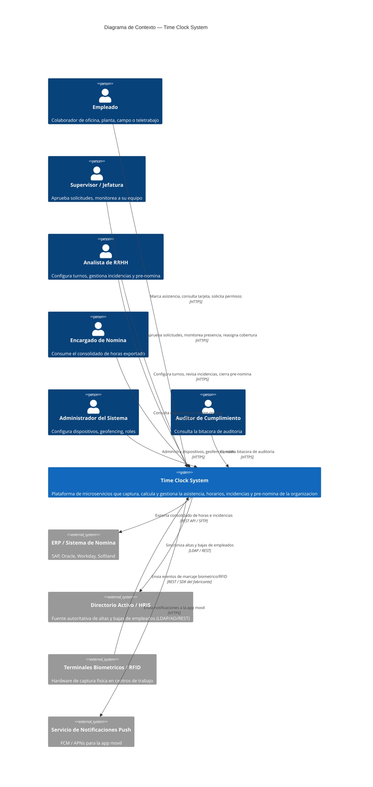
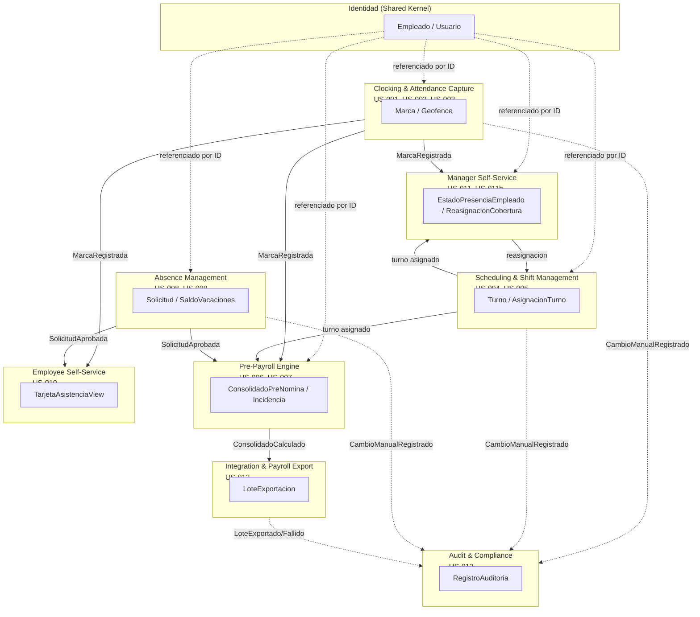
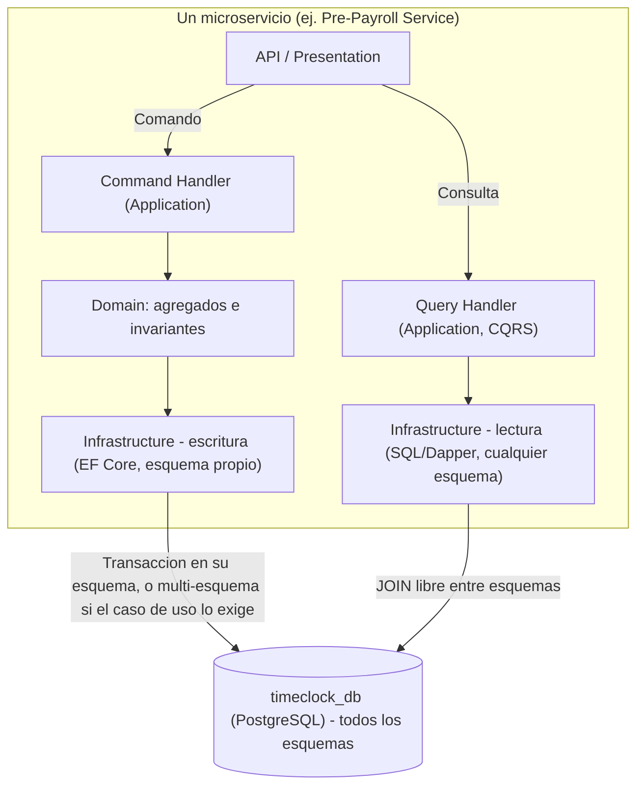
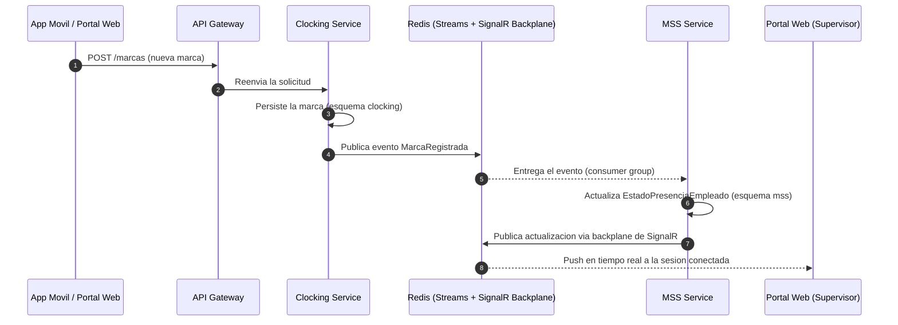
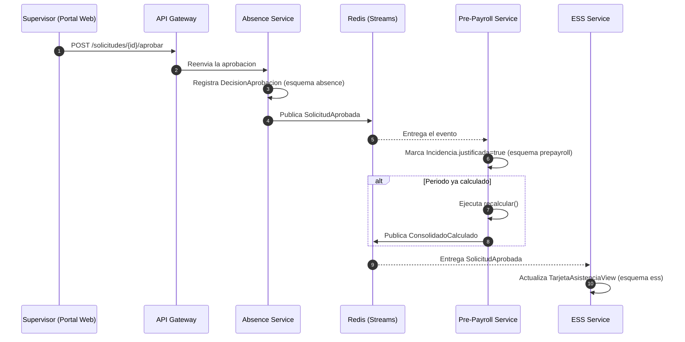
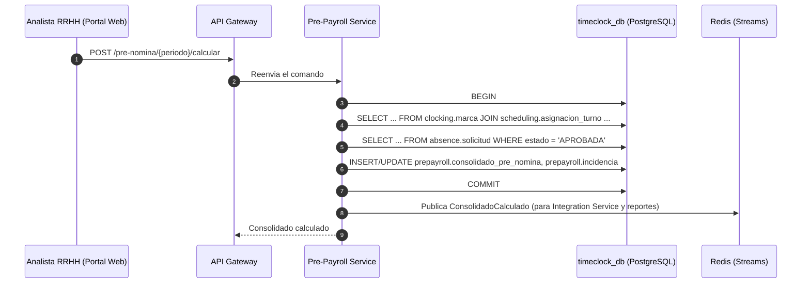

# Technical Specification — Time Clock System

> **Entregable**: `technical-spec.md` — Arquitectura, stack, patrones, seguridad y persistencia.
> **Fuentes originales** (contenido reproducido y organizado bajo los 5 encabezados solicitados, sin reescribir el texto técnico):
> - [`docs/architecture/c4-containers.md`](../docs/architecture/c4-containers.md) (v3.0) — arquitectura de contenedores, stack, patrones de comunicación, consideraciones transversales.
> - [`docs/architecture/decisions/ADR-001-clean-architecture-cqrs-vs-microservicios-multiples-bd.md`](../docs/architecture/decisions/ADR-001-clean-architecture-cqrs-vs-microservicios-multiples-bd.md) — decisión formal de patrones (Clean Architecture + CQRS) y persistencia.
> - [`docs/architecture/domain-model.md`](../docs/architecture/domain-model.md) — bounded contexts, eventos de dominio y mapa de contextos (§1, §11, §12 reproducidos aquí; el detalle completo de agregados/invariantes por contexto, con sus diagramas de clases, permanece en el documento original por su extensión).
>
> ⚠️ Nota de alcance de este entregable: estos tres documentos describen una **visión arquitectónica objetivo** (9 microservicios .NET 10 + PostgreSQL + Redis + Kubernetes) que es **distinta** del sistema realmente implementado en `src/` de este repositorio (un monolito Clean Architecture de 2 proyectos — `TimeClockSystem.Api` + `TimeClockSystem.Web` — sobre SQL Server, sin microservicios). Ver [`ENTREGABLES/traceability.md`](./traceability.md) para el detalle de qué parte de esta visión tiene un endpoint ya implementado.

---

## 1. Arquitectura

### 1.1 Decisión arquitectónica

*Fuente: `c4-containers.md` §1.*

Cada bounded context del modelo de dominio se implementa como un microservicio independientemente desplegable. Esto reemplaza la decisión previa de monolito modular: ya no existe un único contenedor "Web API" que aloje todos los módulos — cada módulo es su propio servicio .NET 10, con su propio ciclo de release y su propio equipo dueño.

Todos los servicios apuntan a una única base de datos PostgreSQL compartida (`timeclock_db`). Dentro de ella existe un esquema por bounded context (`identity`, `clocking`, `scheduling`, `prepayroll`, `absence`, `ess`, `mss`, `integration`, `audit`), pero ese esquema es una decisión de organización y legibilidad del modelo de datos — no una frontera de seguridad ni de acceso.

**Por qué microservicios en este dominio** (`c4-containers.md` §1.1):

| Driver | Justificación |
|---|---|
| Perfiles de carga muy distintos | `Clocking` recibe ráfagas de escritura de alto volumen desde terminales biométricos/RFID y sincronizaciones offline masivas; `Audit` es predominantemente de solo-inserción; `Reportes`/`ESS` son de lectura intensiva. Escalar cada uno de forma independiente evita sobre-aprovisionar el resto. |
| Aislamiento de fallas | Una caída o degradación del conector con el ERP (`Integration`) no debe impedir que un empleado registre su marca de entrada (`Clocking`). |
| Cadencia de cambio distinta | Las reglas legales de horas extra (`Pre-Payroll`) cambian por normativa con más frecuencia que el núcleo de captura de marcas; desplegarlas por separado reduce el riesgo de regresión cruzada. |
| Cumplimiento normativo | `Audit` exige garantías de inmutabilidad (append-only): su tabla en el esquema `audit` no otorga `UPDATE`/`DELETE` a ningún rol de aplicación, y su servicio se despliega por separado para que un incidente en cualquier otro módulo no afecte su disponibilidad de escritura. |
| Autonomía de equipos | Permite asignar un servicio (o un grupo pequeño) por equipo, con contratos de API/eventos como frontera de coordinación en lugar de código compartido. |

**Principios que gobiernan el diseño** (`c4-containers.md` §1.3):

1. Independencia de despliegue y de código, no de datos.
2. Los esquemas agrupan, no aíslan — cualquier servicio puede acceder a cualquier esquema.
3. El dueño del agregado sigue encapsulando sus reglas de negocio — el acceso abierto es para consultas o transacciones de consistencia inmediata, no para reimplementar invariantes ajenas.
4. Un punto de entrada único para los clientes (API Gateway).
5. Consistencia inmediata cuando el caso de uso lo exige, eventos de dominio para el resto.

### 1.2 Servicios (uno por bounded context)

*Fuente: `c4-containers.md` §2.*

| # | Microservicio | Bounded context (`domain-model.md`) | Historias | Esquema principal (en `timeclock_db`) |
|---|---|---|---|---|
| 0 | **Identity Service** | Identidad (§2) | Transversal (Usuario/Empleado, RBAC) | `identity` |
| 1 | **Clocking Service** | Clocking & Attendance Capture (§3) | US-001, 002, 003 | `clocking` |
| 2 | **Scheduling Service** | Scheduling & Shift Management (§4) | US-004, 005 | `scheduling` |
| 3 | **Pre-Payroll Service** | Pre-Payroll Engine (§5) | US-006, 007 | `prepayroll` |
| 4 | **Absence Service** | Absence Management (§6) | US-008, 009 | `absence` |
| 5 | **Employee Self-Service (ESS) Service** | Employee Self-Service (§7) | US-010 | `ess` (read model) |
| 6 | **Manager Self-Service (MSS) Service** | Manager Self-Service (§8) | US-011, 011b | `mss` (read model + `ReasignacionCobertura`) |
| 7 | **Integration Service** | Integration & Payroll Export (§9) | US-012 | `integration` |
| 8 | **Audit Service** | Audit & Compliance (§10) | US-013 | `audit` (append-only, particionado) |

### 1.3 Diagramas C4

*Fuente: `c4-containers.md` §3–§4 (diagramas Mermaid `C4Context`/`C4Container` reproducidos íntegros).*

**Nivel 1 — Contexto**:

**Nivel 2 — Contenedores (microservicios)**:

```mermaid
C4Container
    title Diagrama de Contenedores — Time Clock System (Arquitectura de Microservicios)

    Person(empleado, "Empleado")
    Person(supervisor, "Supervisor")
    Person(rrhhAdmin, "Analista RRHH / Administrador")

    System_Boundary(tcs, "Time Clock System") {
        Container(appMovil, "App Movil", "Flutter / .NET MAUI", "Marcaje biometrico y GPS con cola offline; sincroniza al recuperar conectividad")
        Container(portalWeb, "Portal Web (ESS/MSS)", "React / TypeScript SPA", "Autoservicio del empleado y del supervisor")
        Container(gateway, "API Gateway", ".NET 10 / YARP", "Punto de entrada unico; enrutamiento, autenticacion, rate limiting; termina WebSocket hacia MSS/ESS")

        Container(identityApi, "Identity API", ".NET 10 / ASP.NET Core", "Empleado, Usuario, RBAC, consentimiento biometrico (esquema identity)")
        Container(clockingApi, "Clocking API", ".NET 10 / ASP.NET Core", "Marca, Geofence, deteccion de fraude/liveness (esquema clocking)")
        Container(schedulingApi, "Scheduling API", ".NET 10 / ASP.NET Core", "Turno, AsignacionTurno, cargas masivas (esquema scheduling)")
        Container(prepayrollApi, "Pre-Payroll API", ".NET 10 / ASP.NET Core", "Calculo de horas extra/recargos; deteccion de tardanzas/ausencias; hospeda el job de cierre diario (esquema prepayroll)")
        Container(absenceApi, "Absence API", ".NET 10 / ASP.NET Core", "Solicitudes, workflow de aprobacion, saldo de vacaciones (esquema absence)")
        Container(essApi, "ESS API", ".NET 10 / ASP.NET Core", "Tarjeta de asistencia y notificaciones, read model (esquema ess)")
        Container(mssApi, "MSS API", ".NET 10 / ASP.NET Core", "Presencia en tiempo real y reasignacion de cobertura; hospeda el Hub de SignalR (esquema mss)")
        Container(integrationApi, "Integration API", ".NET 10 / ASP.NET Core", "Exportacion a ERP, sincronizacion con directorio activo; hospeda el job programado de exportacion (esquema integration)")
        Container(auditApi, "Audit API", ".NET 10 / ASP.NET Core", "Bitacora de auditoria, solo lectura/insercion (esquema audit)")

        ContainerDb(postgres, "timeclock_db", "PostgreSQL 16", "Base de datos unica compartida; esquemas por bounded context (identity, clocking, scheduling, prepayroll, absence, ess, mss, integration, audit) como agrupacion logica, sin restriccion de acceso entre ellos")
        ContainerDb(redis, "Redis 7", "Redis", "Cache distribuido compartido + bus de eventos (Pub/Sub y Streams) + locks distribuidos + backplane de SignalR")
    }

    System_Ext(erp, "ERP / Nomina", "SAP, Oracle, Workday, Softland")
    System_Ext(directorio, "Directorio Activo / HRIS", "LDAP / Active Directory / REST")
    System_Ext(biometria, "Terminales Biometricos / RFID", "Hardware de terceros")
    System_Ext(push, "Notificaciones Push", "FCM / APNs")

    Rel(empleado, appMovil, "Marca entrada/salida, incluso sin conectividad", "HTTPS")
    Rel(empleado, portalWeb, "Marca asistencia, consulta tarjeta, solicita permisos", "HTTPS")
    Rel(supervisor, portalWeb, "Aprueba solicitudes, monitorea equipo, reasigna cobertura", "HTTPS")
    Rel(rrhhAdmin, portalWeb, "Configura turnos, reglas legales, dispositivos y roles", "HTTPS")

    Rel(appMovil, gateway, "Envia marcas (online o en lote al sincronizar)", "HTTPS/REST")
    Rel(portalWeb, gateway, "Invoca comandos y consultas", "HTTPS/REST")
    Rel(portalWeb, gateway, "Recibe eventos de presencia y notificaciones", "WebSocket")
    Rel(biometria, gateway, "Envia eventos de marcaje biometrico/RFID", "REST / SDK")

    Rel(gateway, identityApi, "Autenticacion, perfil, RBAC", "REST")
    Rel(gateway, clockingApi, "Registra/consulta marcas", "REST")
    Rel(gateway, schedulingApi, "Consulta/asigna turnos", "REST")
    Rel(gateway, prepayrollApi, "Consulta pre-nomina e incidencias", "REST")
    Rel(gateway, absenceApi, "Crea/aprueba solicitudes", "REST")
    Rel(gateway, essApi, "Consulta tarjeta de asistencia", "REST")
    Rel(gateway, mssApi, "Panel de presencia, reasignaciones", "REST + WebSocket")
    Rel(gateway, integrationApi, "Consulta/dispara exportaciones", "REST")
    Rel(gateway, auditApi, "Consulta bitacora de auditoria", "REST")

    Rel(identityApi, postgres, "Lee/escribe (esquema identity)", "EF Core")
    Rel(clockingApi, postgres, "Lee/escribe (esquema clocking)", "EF Core")
    Rel(schedulingApi, postgres, "Lee/escribe (esquema scheduling)", "EF Core")
    Rel(prepayrollApi, postgres, "Lee/escribe (esquema prepayroll)", "EF Core")
    Rel(absenceApi, postgres, "Lee/escribe (esquema absence)", "EF Core")
    Rel(essApi, postgres, "Lee/escribe proyeccion (esquema ess)", "EF Core")
    Rel(mssApi, postgres, "Lee/escribe proyeccion (esquema mss)", "EF Core")
    Rel(integrationApi, postgres, "Lee/escribe (esquema integration)", "EF Core")
    Rel(auditApi, postgres, "Solo insercion / lectura (esquema audit)", "EF Core")

    Rel(prepayrollApi, postgres, "JOIN directo a los esquemas clocking y scheduling para leer marcas y turnos del periodo a cerrar", "SQL / Dapper")
    Rel(integrationApi, postgres, "JOIN directo al esquema prepayroll para obtener el consolidado a exportar", "SQL / Dapper")
    Rel(integrationApi, identityApi, "Ordena alta/baja detectada en el directorio activo (comando de dominio)", "REST interno")

    Rel(clockingApi, redis, "Publica MarcaRegistrada, MarcaRechazada; valida idempotencia offline", "Pub/Sub + Streams")
    Rel(schedulingApi, redis, "Publica AsignacionTurnoCreada", "Streams")
    Rel(absenceApi, redis, "Publica SolicitudAprobada, SolicitudRechazada", "Streams")
    Rel(prepayrollApi, redis, "Publica ConsolidadoCalculado, CierreDiarioEjecutado; usa locks distribuidos", "Streams")
    Rel(integrationApi, redis, "Publica LoteExportado, LoteFallido", "Streams")
    Rel(identityApi, redis, "Publica EmpleadoSincronizado", "Streams")

    Rel(mssApi, redis, "Consume MarcaRegistrada, AsignacionTurnoCreada; backplane de SignalR", "Pub/Sub + Streams")
    Rel(essApi, redis, "Consume MarcaRegistrada, SolicitudAprobada/Rechazada, CierreDiarioEjecutado", "Streams")
    Rel(auditApi, redis, "Consume eventos de cambio manual y de exportacion de todos los servicios", "Streams")

    Rel(integrationApi, erp, "Exporta consolidado via API REST o archivo SFTP", "REST / SFTP")
    Rel(integrationApi, directorio, "Sincroniza altas/bajas", "LDAP / REST")
    Rel(essApi, push, "Envia notificaciones (marca omitida, aprobacion, rechazo)", "HTTPS")
```

### 1.4 Mapa de bounded contexts y eventos

*Fuente: `domain-model.md` §1 (enfoque), §11 (eventos), §12 (mapa).*

El dominio se modela con **Domain-Driven Design (DDD)**: se identifican bounded contexts alineados 1:1 con los módulos funcionales de la visión, cada uno con sus propios aggregate roots, invariantes y ciclo de vida. Los contextos no comparten entidades directamente entre sí — se referencian por identidad (ID) y se comunican mediante eventos de dominio, porque cada bounded context se implementa como un microservicio independiente.

**Trazabilidad Historia de Usuario → Bounded Context → Agregado** (`domain-model.md` §1.2):

| Historia | Bounded Context | Agregado(s) raíz principal(es) |
|---|---|---|
| US-001 Marcaje Web/Móvil | Clocking & Attendance Capture | `Marca` |
| US-002 Marcaje Biométrico con Geofencing | Clocking & Attendance Capture | `Marca`, `Geofence` |
| US-003 Marcaje Offline y Sincronización | Clocking & Attendance Capture | `Marca` |
| US-004 Configuración de Turnos Rotativos y Fijos | Scheduling & Shift Management | `Turno` |
| US-005 Asignación Masiva de Calendarios | Scheduling & Shift Management | `CargaMasivaCalendario`, `AsignacionTurno` |
| US-006 Cálculo Automático de Horas Extra y Recargos | Pre-Payroll Engine | `ConsolidadoPreNomina` |
| US-007 Detección Automática de Tardanzas y Ausencias | Pre-Payroll Engine | `Incidencia` |
| US-008 Solicitud de Permisos y Vacaciones | Absence Management | `Solicitud`, `SaldoVacaciones` |
| US-009 Aprobación de Incidencias por Jefatura | Absence Management | `Solicitud`, `DecisionAprobacion` |
| US-010 Consulta de Tarjeta de Asistencia | Employee Self-Service | `TarjetaAsistenciaView` (read model) |
| US-011 Monitor de Presencia en Tiempo Real | Manager Self-Service | `EstadoPresenciaEmpleado` (read model) |
| US-011b Reasignación Rápida de Turnos | Manager Self-Service | `ReasignacionCobertura` |
| US-012 Exportación e Integración con Sistema de Nómina | Integration & Payroll Export | `LoteExportacion` |
| US-013 Bitácora de Auditoría | Audit & Compliance | `RegistroAuditoria` |

**Eventos de dominio entre contextos** (`domain-model.md` §11):

| Evento | Publicado por | Consumido por | Efecto |
|---|---|---|---|
| `MarcaRegistrada` | Clocking | Manager Self-Service, Employee Self-Service, Pre-Payroll | Actualiza `EstadoPresenciaEmpleado`; recalcula `TarjetaAsistenciaView`; insumo para cierre diario |
| `MarcaRechazada` | Clocking | Audit | Registra intento de fraude/geofencing como evento de seguridad |
| `CierreDiarioEjecutado` | Pre-Payroll | Absence Management, Employee/Manager SS | Clasifica ausencias; actualiza vistas de presencia e incidencias |
| `SolicitudAprobada` / `SolicitudRechazada` | Absence Management | Pre-Payroll, Employee Self-Service | Marca `Incidencia.justificada`; dispara `recalcular()` si el periodo ya fue calculado; actualiza `SaldoVacaciones` |
| `ConsolidadoCalculado` | Pre-Payroll | Integration, Reportes/BI | Habilita el `LoteExportacion` del periodo |
| `LoteExportado` / `LoteFallido` | Integration | Audit | Trazabilidad de exportaciones hacia el ERP |
| `AltaBajaDetectada` (comando síncrono) | Integration → Identidad | Identidad | Integration detecta el cambio en el directorio activo y ordena la creación/baja |
| `EmpleadoSincronizado` (alta/baja) | Identidad | Todos los demás contextos | Actualiza las proyecciones locales de `EmpleadoId` en cada contexto |
| `CambioManualRegistrado` | Cualquier contexto | Audit | Inserción síncrona de `RegistroAuditoria` |

**Mapa de bounded contexts** (`domain-model.md` §12):

> Para el detalle completo de cada bounded context (atributos de cada agregado, invariantes clave, diagramas de clases individuales), ver el documento completo [`docs/architecture/domain-model.md`](../docs/architecture/domain-model.md) §2–§10.

### 1.5 Historial de cambios de la arquitectura

*Fuente: `c4-containers.md` §8.*

| Versión | Cambio |
|---|---|
| 1.0 | Monolito modular: un único contenedor "Web API (.NET 10)" alojando los 9 módulos, con PostgreSQL de esquema-por-módulo y Redis como cache/backplane |
| 2.0 | Se adopta arquitectura de microservicios: cada bounded context pasa a ser un servicio .NET 10 independiente con su propia base de datos PostgreSQL (*database-per-service*); se introduce un API Gateway como punto de entrada único; Redis pasa a asumir también el rol de bus de eventos (Pub/Sub + Streams) entre servicios |
| 2.1 | Se mantienen los servicios independientes, pero se consolida la persistencia en una única base de datos PostgreSQL compartida (`timeclock_db`); cada servicio conserva un esquema y un rol de base de datos exclusivos, con el límite de propiedad de datos aplicado a nivel de permisos |
| **3.0** | Se elimina el aislamiento por permisos entre esquemas: cualquier servicio puede leer, escribir, hacer `JOIN` o transaccionar sobre cualquier esquema cuando el caso de uso lo requiera. Se introduce Clean Architecture + CQRS como el patrón que sostiene esta decisión a nivel de código |

---

## 2. Stack tecnológico

*Fuente: extraído de `c4-containers.md` §2 y §4 (tipos de contenedor y tecnologías indicadas en cada uno).*

| Componente | Tecnología |
|---|---|
| App móvil | Flutter / .NET MAUI |
| Portal web (ESS/MSS) | React / TypeScript (SPA) |
| API Gateway | .NET 10 / YARP |
| Los 9 microservicios (Identity, Clocking, Scheduling, Pre-Payroll, Absence, ESS, MSS, Integration, Audit) | .NET 10 / ASP.NET Core |
| Acceso a datos (escritura) | EF Core |
| Acceso a datos (consultas cruzadas entre esquemas) | SQL / Dapper |
| Base de datos | PostgreSQL 16 (`timeclock_db`, única instancia compartida) |
| Cache / bus de eventos / backplane tiempo real | Redis 7 (Pub/Sub + Streams; backplane de SignalR) |
| Tiempo real hacia el navegador | SignalR (hospedado en MSS API) |
| Resiliencia entre servicios | Polly (retries + circuit breaker) |
| Observabilidad | OpenTelemetry + W3C Trace Context |
| Connection pooling de base de datos | PgBouncer |
| Despliegue | Contenedor Docker por servicio, orquestado en Kubernetes (o equivalente) |
| Integración externa (ERP/Nómina) | REST API o archivo plano (SFTP) — SAP, Oracle, Workday, Softland |
| Integración externa (directorio) | LDAP / Active Directory / REST |
| Notificaciones push | FCM / APNs |

---

## 3. Patrones

### 3.1 Clean Architecture + CQRS (ADR-001)

*Fuente: `ADR-001` completo (decisión aceptada).*

**Contexto**: el Time Clock System se descompone en 9 bounded contexts, cada uno implementado como servicio independientemente desplegable. La pregunta que resuelve este ADR es cómo persisten los datos de esos servicios.

**Decisión adoptada**:

1. **Múltiples servicios independientes**: uno por bounded context, cada uno con su propio código, pipeline de CI/CD y despliegue.
2. **Clean Architecture dentro de cada servicio**: capas `Domain` (entidades y agregados con sus invariantes), `Application` (casos de uso / *handlers*), `Infrastructure` (EF Core, integraciones externas, consultas SQL) y `Presentation/API`. El dominio no depende de detalles de persistencia.
3. **CQRS (Command Query Responsibility Segregation)** como el patrón que decide *cómo* se accede a los datos:
   - **Comandos** (escrituras que aplican reglas de negocio) pasan por la capa `Application`/`Domain` del servicio dueño del agregado.
   - **Consultas** (lecturas, incluidas las que combinan varios bounded contexts) se implementan como SQL/Dapper o un `DbContext` de solo lectura que puede unir (`JOIN`) libremente tablas de cualquier esquema.
4. **Una única base de datos PostgreSQL compartida**, con esquemas como agrupamiento lógico, no de aislamiento.

**Opciones consideradas y descartadas**:

| | Opción A (elegida) — Clean Architecture + CQRS, BD única abierta | Opción B (descartada) — *database-per-service* | Opción C (descartada) — BD compartida con aislamiento por esquema |
|---|---|---|---|
| Aislamiento de despliegue/código | Sí | Sí | Sí |
| Aislamiento de datos | No — deliberado | Sí, total | Sí, por permisos |
| Consistencia entre bounded contexts | Inmediata cuando se necesita + eventual vía eventos | Solo eventual (sagas) | Solo eventual, igual que B |
| Complejidad de consultas cruzadas | Baja — `JOIN` SQL directo | Alta | Alta — misma limitación que B |
| Costo de infraestructura de datos | Una instancia PostgreSQL | Una instancia por servicio (9) | Una instancia PostgreSQL |
| Riesgo principal | Disciplina de acceso depende de convención de equipo, no de control técnico | Sobre-ingeniería para el volumen/escala actual | Paga el costo operativo de B sin su aislamiento físico real |

La Opción C se descarta por ser, en este contexto, la peor combinación: impone la disciplina operativa de los microservicios puros (eventos, proyecciones, sagas) sin ninguno de sus beneficios de aislamiento físico real.

**Diagrama de capas (comandos vs. consultas)**:

### 3.2 Patrones de comunicación entre servicios

*Fuente: `c4-containers.md` §5.*

| Patrón | Cuándo se usa | Ejemplo |
|---|---|---|
| **REST síncrono, cliente → Gateway → servicio** | Toda interacción iniciada por un usuario final | Empleado envía una `Solicitud` de vacaciones vía Portal Web |
| **REST síncrono, servicio → servicio** | El caso de uso es un comando que debe aplicar las reglas de negocio del servicio dueño de otro bounded context | `Integration Service` ordena a `Identity Service` el alta/baja detectada en el directorio activo |
| **SQL directo entre esquemas (`JOIN` / transacción multi-esquema)** | El caso de uso es una consulta (CQRS) que combina datos de varios bounded contexts, o requiere consistencia atómica inmediata | `Pre-Payroll Service` hace `JOIN` contra `clocking` y `scheduling` al ejecutar el cierre de un periodo |
| **Eventos de dominio asíncronos (Redis Streams)** | Propagar un hecho ya ocurrido a los servicios interesados, sin acoplar su disponibilidad a la del publicador | `MarcaRegistrada` actualiza la proyección de presencia en `MSS Service` y la tarjeta de asistencia en `ESS Service` |
| **Pub/Sub en tiempo real (Redis + SignalR backplane)** | Empujar actualizaciones a clientes conectados | `MSS Service` difunde el nuevo estado de presencia a todas las sesiones de supervisores conectadas |

El criterio para elegir entre SQL directo y REST/eventos es CQRS: **consultas y transacciones de consistencia inmediata → SQL directo; comandos que deben pasar por las reglas de negocio de otro servicio → REST; notificación de hechos ya ocurridos → eventos**.

**Ejemplo — marcaje y actualización de presencia en tiempo real (US-011)**:

**Ejemplo — aprobación que dispara recálculo de pre-nómina (US-009 → US-006)**:

**Ejemplo — consulta y transacción SQL directa entre esquemas (US-006)**:

---

## 4. Seguridad

*Fuente: `c4-containers.md` §7 (fila "Autenticación/Autorización"), `domain-model.md` §2 y §10, `vision.md` §4.2 y Principio 6.*

| Aspecto | Enfoque |
|---|---|
| **Autenticación/Autorización** | `Identity Service` emite tokens JWT (OpenID Connect); el `API Gateway` valida el token en el borde y lo reenvía; cada microservicio además revalida el token como *resource server* (defensa en profundidad) y aplica RBAC por rol (`RolUsuario`) |
| **Roles soportados** | `EMPLEADO`, `SUPERVISOR`, `ANALISTA_RRHH`, `ENCARGADO_NOMINA`, `ADMINISTRADOR`, `AUDITOR_CUMPLIMIENTO`, `TI_INTEGRACIONES`, `EJECUTIVO` (`domain-model.md` §2, enum `RolUsuario`) |
| **Consentimiento biométrico** | `ConsentimientoBiometrico` (aggregate del Identity Service) es prerrequisito de negocio para que `Marca` acepte captura biométrica o geolocalización — "privacidad por diseño" (`domain-model.md` §2; `vision.md` Principio 6) |
| **Protección de datos biométricos** | El tratamiento de datos biométricos requiere consentimiento explícito y cumplimiento de normativa de protección de datos equivalente a GDPR o la ley local aplicable (`vision.md` §4.2) |
| **Inmutabilidad de auditoría** | `RegistroAuditoria` no expone operaciones de actualización ni borrado, ni siquiera a nivel administrativo; solo `registrar()` (inserción) y consultas de lectura (`domain-model.md` §10) |
| **Trazabilidad distribuida** | Todo request propaga un `traceId`/`correlationId` (W3C Trace Context) desde el Gateway hasta cada servicio y hacia los eventos publicados en Redis, recolectado vía OpenTelemetry |
| **Gobernanza de acceso a datos** | No se aplica mediante permisos de base de datos: se gobierna por convención de equipo, revisión de código y pruebas de integración; las consultas/transacciones cruzadas entre esquemas se documentan explícitamente en el código |

---

## 5. Persistencia

*Fuente: `c4-containers.md` §1.2, §6, §7; `ADR-001` (decisión y consecuencias).*

### 5.1 Modelo de persistencia

Una única base de datos física **PostgreSQL 16** (`timeclock_db`) compartida por los 9 servicios. Los esquemas (`identity`, `clocking`, `scheduling`, `prepayroll`, `absence`, `ess`, `mss`, `integration`, `audit`) son **agrupación lógica de tablas por bounded context**, no una frontera de seguridad ni de acceso: cualquier servicio puede leer, escribir, unir (`JOIN`) o ejecutar una transacción sobre cualquier tabla de cualquier esquema cuando el caso de uso lo requiera.

### 5.2 Propiedad de datos y consistencia entre esquemas

*Fuente: `c4-containers.md` §6.*

- Los esquemas son agrupación lógica, no una frontera transaccional: una transacción ACID normal puede abarcar tablas de varios esquemas sin dos-fases-de-confirmación (2PC) ni compensación, porque es una transacción local de un único motor de base de datos.
- Las consultas de solo lectura pueden unir (`JOIN`) cualquier esquema: las proyecciones de `ESS Service`, `MSS Service` y los reportes se construyen con SQL que combina tablas de varios bounded contexts directamente.
- Las transacciones multi-esquema se usan cuando la consistencia inmediata importa (p. ej. aprobar una `Solicitud` y confirmar/liberar el `SaldoVacaciones` en la misma transacción).
- El patrón por defecto para comandos que mutan reglas de negocio de otro bounded context sigue siendo invocar su capa de aplicación (en proceso o vía su API); el acceso SQL abierto no sustituye la responsabilidad de cada servicio de mantener las invariantes de su propio agregado.
- Los eventos de dominio se siguen usando para notificar hechos ya ocurridos a servicios que no necesitan consistencia inmediata.
- Idempotencia obligatoria en todo endpoint que reciba reintentos o sincronización en lote.

### 5.3 Riesgos aceptados y mitigaciones

*Fuente: `ADR-001` — Consecuencias / Negativas.*

- **Punto único de escalamiento y de falla**: mitigado con alta disponibilidad (réplica de conmutación), *connection pooling* (PgBouncer) y una réplica de solo lectura para consultas intensivas.
- **Nada a nivel de base de datos impide que un servicio escriba por error en la tabla de otro bounded context**: se gobierna por convención de equipo y revisión de código, no por `GRANT`; todo comando que mute datos de otro bounded context documenta en el código por qué necesita hacerlo directamente (referencia al ADR).
- **Acoplamiento de evolución de esquema entre servicios**: mitigado con pruebas de integración que cubran las consultas/transacciones cruzadas conocidas y comunicación temprana de cambios entre equipos.
- **Migrar en el futuro a bases de datos físicamente separadas** exigiría primero eliminar los `JOIN`/transacciones cruzadas existentes — se acepta como costo de una migración futura, no como bloqueador actual.

### 5.4 Capacidad de la base de datos compartida

*Fuente: `c4-containers.md` §7.* Al ser una única instancia para los 9 servicios, se dimensiona con margen y se protege con *connection pooling* (PgBouncer), alta disponibilidad (réplica de conmutación) y una réplica de solo lectura para las consultas intensivas de `ESS Service`, `MSS Service` y reportes, evitando que compitan por el mismo primario transaccional.

---

## 6. Documentos relacionados

- [`docs/architecture/c4-containers.md`](../docs/architecture/c4-containers.md) — Documento fuente principal (arquitectura, stack, patrones de comunicación, seguridad, persistencia).
- [`docs/architecture/decisions/ADR-001-clean-architecture-cqrs-vs-microservicios-multiples-bd.md`](../docs/architecture/decisions/ADR-001-clean-architecture-cqrs-vs-microservicios-multiples-bd.md) — Documento fuente de los patrones (§3) y la decisión de persistencia (§5).
- [`docs/architecture/domain-model.md`](../docs/architecture/domain-model.md) — Documento fuente del mapa de bounded contexts (§1.4) y detalle completo de agregados por contexto (no reproducido íntegro aquí por extensión).
- [`ENTREGABLES/requirements.md`](./requirements.md) — RNF de seguridad/resiliencia/disponibilidad derivados de este documento.
- [`ENTREGABLES/traceability.md`](./traceability.md) — Qué parte de esta arquitectura objetivo corresponde a un endpoint ya implementado en el sistema real del repositorio.
