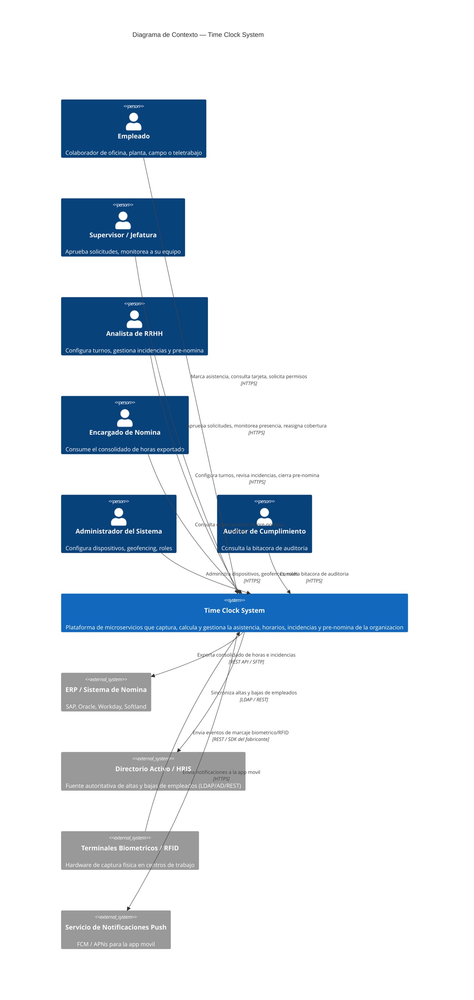
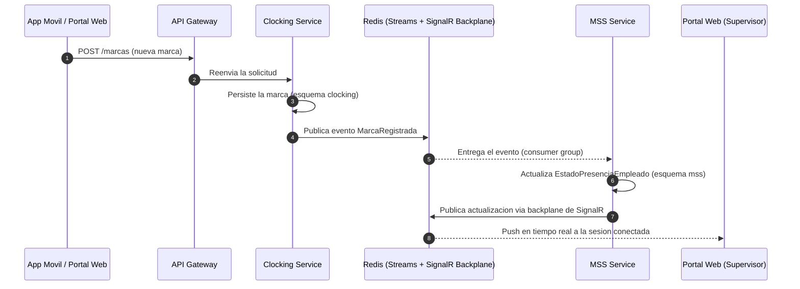
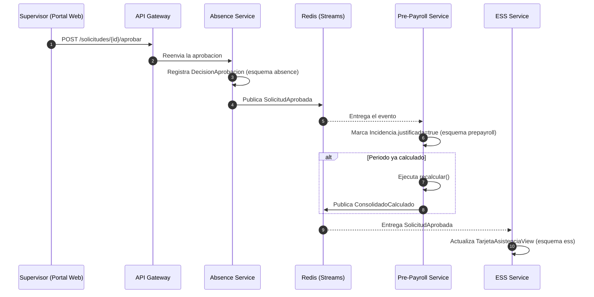
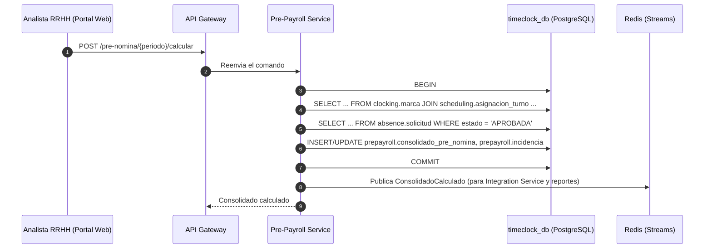

# Arquitectura de Contenedores (C4) — Time Clock System

| Campo | Valor |
|---|---|
| Versión | 3.0 |
| Estado | Borrador para revisión |
| Autor | Software Architect |
| Fecha | 2026-09-22 |
| Reemplaza | v2.1 (microservicios, base de datos compartida con aislamiento por esquema/permisos) — ver historial de cambios en §8 |
| Justificación formal | `docs/architecture/decisions/ADR-001-clean-architecture-cqrs-vs-microservicios-multiples-bd.md` |
| Insumos | `docs/specs/functional/01-vision-document.md`, `docs/specs/functional/02-user-stories.md`, `docs/architecture/domain-model.md` |

## 1. Decisión arquitectónica

**Cada bounded context del modelo de dominio (`domain-model.md`) se implementa como un microservicio independientemente desplegable.** Esto reemplaza la decisión previa de monolito modular: ya no existe un único contenedor "Web API" que aloje todos los módulos — cada módulo es su propio servicio .NET 10, con su propio ciclo de release y su propio equipo dueño.

**Todos los servicios apuntan a una única base de datos PostgreSQL compartida** (`timeclock_db`). Dentro de ella existe un esquema por bounded context (`identity`, `clocking`, `scheduling`, `prepayroll`, `absence`, `ess`, `mss`, `integration`, `audit`), pero **ese esquema es una decisión de organización y legibilidad del modelo de datos — no una frontera de seguridad ni de acceso**. Cualquier servicio puede leer, escribir, unir (`JOIN`) o ejecutar una transacción sobre cualquier tabla de cualquier esquema cuando el caso de uso lo requiera; no hay restricciones de permisos entre esquemas. La justificación completa de esta decisión — frente a la alternativa de microservicios con una base de datos independiente por servicio — está documentada en **ADR-001** (ver tabla de cabecera).

### 1.1 Por qué microservicios en este dominio

| Driver | Justificación |
|---|---|
| Perfiles de carga muy distintos | `Clocking` recibe ráfagas de escritura de alto volumen desde terminales biométricos/RFID y sincronizaciones offline masivas; `Audit` es predominantemente de solo-inserción; `Reportes`/`ESS` son de lectura intensiva. Escalar cada uno de forma independiente evita sobre-aprovisionar el resto. |
| Aislamiento de fallas | Una caída o degradación del conector con el ERP (`Integration`) no debe impedir que un empleado registre su marca de entrada (`Clocking`). |
| Cadencia de cambio distinta | Las reglas legales de horas extra (`Pre-Payroll`) cambian por normativa con más frecuencia que el núcleo de captura de marcas; desplegarlas por separado reduce el riesgo de regresión cruzada. |
| Cumplimiento normativo | `Audit` exige garantías de inmutabilidad (append-only): su tabla en el esquema `audit` no otorga `UPDATE`/`DELETE` a ningún rol de aplicación, y su servicio se despliega por separado para que un incidente en cualquier otro módulo no afecte su disponibilidad de escritura. |
| Autonomía de equipos | Permite asignar un servicio (o un grupo pequeño) por equipo, con contratos de API/eventos como frontera de coordinación en lugar de código compartido. |

Esta decisión **incrementa la complejidad operativa** (más pipelines de CI/CD, consistencia eventual entre servicios, necesidad de trazabilidad distribuida). Se acepta ese costo porque el requisito explícito de arquitectura es que cada módulo sea un servicio independiente; §7 detalla las mitigaciones (observabilidad, resiliencia, contratos).

### 1.2 Por qué una única base de datos con acceso compartido entre esquemas

La v2.0 de este documento proponía *database-per-service* (una instancia física de PostgreSQL por servicio); la v2.1 mantenía una base compartida pero con permisos aislados por esquema. Ambas se descartan a favor de una base de datos única con **acceso abierto entre esquemas para cualquier servicio**. Razones principales (ver ADR-001 para el análisis completo de alternativas):

| Driver | Justificación |
|---|---|
| Consistencia inmediata en flujos críticos de negocio | Cálculos de nómina, saldos de vacaciones y cierres de periodo no toleran bien la consistencia eventual: una transacción SQL normal (no distribuida, porque es un único motor de base de datos) puede abarcar varios esquemas sin sagas ni compensación |
| Reportería y proyecciones de lectura simples | `ESS`, `MSS` y BI pueden construirse con consultas SQL que hacen `JOIN` directo entre esquemas, sin *event-carried state transfer* ni componer resultados de varias APIs |
| Costo operativo de infraestructura | Una sola instancia de PostgreSQL (backup, parcheo, monitoreo, alta disponibilidad, dimensionamiento) frente a nueve, relevante para el tamaño de equipo/etapa actual del proyecto |
| Simplicidad de entornos | Un solo connection string/instancia para levantar en desarrollo, pruebas y ambientes efímeros |

Los esquemas (`identity`, `clocking`, …) se conservan **únicamente como agrupación lógica de tablas por bounded context** — el equivalente, a nivel de base de datos, de organizar el código en carpetas por módulo. No implementan ni pretenden implementar aislamiento.

**Riesgos aceptados y cómo se gobiernan** (sin recurrir a permisos de base de datos — ver también §6 y §7):
- *Un servicio podría escribir por error sobre datos de otro bounded context*: se gobierna por convención de equipo y revisión de código, no por `GRANT`. El patrón por defecto (§1.3, principio 3) sigue siendo que las escrituras de negocio pasen por la capa de aplicación del servicio dueño.
- *Punto único de fallo y de contención de recursos*: una única instancia concentra la disponibilidad y el rendimiento de los 9 servicios. Se mitiga con alta disponibilidad (réplica de conmutación), *connection pooling* (PgBouncer) y una réplica de lectura para las consultas intensivas (§7).
- *Acoplamiento estructural entre esquemas*: los `JOIN`/transacciones cruzadas son ahora parte legítima del diseño, no un antipatrón a evitar; se documentan en el código (capa de Infrastructure/Query, ver ADR-001) para que su alcance sea explícito y se cubran con pruebas de integración.

### 1.3 Principios que gobiernan el diseño

1. **Independencia de despliegue y de código, no de datos**: cada bounded context es un servicio .NET 10 desplegable por separado, con su propio repositorio/proyecto, pipeline y ciclo de release. La independencia es de **proceso y de código**; la capa de datos es deliberadamente compartida (§1.2).
2. **Los esquemas agrupan, no aíslan**: `identity`, `clocking`, `scheduling`, `prepayroll`, `absence`, `ess`, `mss`, `integration` y `audit` organizan las tablas por bounded context para mantener el modelo de datos legible. **Cualquier servicio puede acceder a cualquier esquema y cualquier tabla, hacer `JOIN` entre ellos y ejecutar transacciones que abarquen varios esquemas cuando el caso de uso lo requiera.**
3. **El dueño del agregado sigue encapsulando sus reglas de negocio**: que el acceso a los datos esté abierto no significa que otro servicio deba reimplementar las invariantes de un bounded context ajeno. Por defecto, los **comandos** (escrituras que aplican reglas de negocio) invocan la capa de aplicación del servicio dueño (en proceso o vía su API); el acceso SQL directo entre esquemas se usa para **consultas** (CQRS, ver ADR-001) o para **transacciones que exigen consistencia atómica inmediata** entre varios contextos (p. ej. aprobar una solicitud y confirmar el saldo de vacaciones en la misma transacción).
4. **Un punto de entrada único para los clientes**: la App Móvil y el Portal Web nunca llaman directamente a un microservicio; siempre pasan por el **API Gateway** (§3).
5. **Consistencia inmediata cuando el caso de uso lo exige, eventos de dominio para el resto**: al disponer de una única base de datos, una transacción ACID directa es una opción real para los flujos donde la corrección inmediata importa (§6); los eventos de dominio (`domain-model.md` §11) se siguen usando para desacoplar disponibilidad entre servicios y alimentar proyecciones de lectura en tiempo real (presencia, notificaciones).

## 2. Servicios (uno por bounded context)

Todos los servicios comparten una única base de datos física: **`timeclock_db` (PostgreSQL 16)**. La columna "esquema" indica dónde vive la mayoría de las tablas de cada servicio — es información de organización del modelo de datos, no una restricción de acceso: cualquier servicio puede consultar, unir o transaccionar contra cualquier esquema cuando lo necesite (§1.2, §1.3).

| # | Microservicio | Bounded context (`domain-model.md`) | Historias | Esquema principal (en `timeclock_db`) |
|---|---|---|---|---|
| 0 | **Identity Service** | Identidad (§2) | Transversal (Usuario/Empleado, RBAC) | `identity` |
| 1 | **Clocking Service** | Clocking & Attendance Capture (§3) | US-001, 002, 003 | `clocking` |
| 2 | **Scheduling Service** | Scheduling & Shift Management (§4) | US-004, 005 | `scheduling` |
| 3 | **Pre-Payroll Service** | Pre-Payroll Engine (§5) | US-006, 007 | `prepayroll` |
| 4 | **Absence Service** | Absence Management (§6) | US-008, 009 | `absence` |
| 5 | **Employee Self-Service (ESS) Service** | Employee Self-Service (§7) | US-010 | `ess` (read model) |
| 6 | **Manager Self-Service (MSS) Service** | Manager Self-Service (§8) | US-011, 011b | `mss` (read model + `ReasignacionCobertura`) |
| 7 | **Integration Service** | Integration & Payroll Export (§9) | US-012 | `integration` |
| 8 | **Audit Service** | Audit & Compliance (§10) | US-013 | `audit` (append-only, particionado) |

Cada servicio es un proyecto **ASP.NET Core independiente sobre .NET 10**, con su propio pipeline de build/deploy y su propio contenedor de ejecución — solo la capa de persistencia física es compartida. Los servicios 5 y 6 (ESS, MSS) son *Backends-for-Frontend* de solo lectura: no poseen agregados transaccionales de negocio (salvo `ReasignacionCobertura` en MSS), sino proyecciones mantenidas mediante *event-carried state transfer* desde los servicios que sí son dueños de esos datos.

## 3. Diagrama de Contexto (C4 Nivel 1)

El nivel de contexto no cambia respecto de la vista externa del sistema — los actores y sistemas externos interactúan con "Time Clock System" como un todo; la descomposición en microservicios es un detalle del Nivel 2 (§4).

## 4. Diagrama de Contenedores (C4 Nivel 2) — Microservicios

```mermaid
C4Container
    title Diagrama de Contenedores — Time Clock System (Arquitectura de Microservicios)

    Person(empleado, "Empleado")
    Person(supervisor, "Supervisor")
    Person(rrhhAdmin, "Analista RRHH / Administrador")

    System_Boundary(tcs, "Time Clock System") {
        Container(appMovil, "App Movil", "Flutter / .NET MAUI", "Marcaje biometrico y GPS con cola offline; sincroniza al recuperar conectividad")
        Container(portalWeb, "Portal Web (ESS/MSS)", "React / TypeScript SPA", "Autoservicio del empleado y del supervisor")
        Container(gateway, "API Gateway", ".NET 10 / YARP", "Punto de entrada unico; enrutamiento, autenticacion, rate limiting; termina WebSocket hacia MSS/ESS")

        Container(identityApi, "Identity API", ".NET 10 / ASP.NET Core", "Empleado, Usuario, RBAC, consentimiento biometrico (esquema identity)")
        Container(clockingApi, "Clocking API", ".NET 10 / ASP.NET Core", "Marca, Geofence, deteccion de fraude/liveness (esquema clocking)")
        Container(schedulingApi, "Scheduling API", ".NET 10 / ASP.NET Core", "Turno, AsignacionTurno, cargas masivas (esquema scheduling)")
        Container(prepayrollApi, "Pre-Payroll API", ".NET 10 / ASP.NET Core", "Calculo de horas extra/recargos; deteccion de tardanzas/ausencias; hospeda el job de cierre diario (esquema prepayroll)")
        Container(absenceApi, "Absence API", ".NET 10 / ASP.NET Core", "Solicitudes, workflow de aprobacion, saldo de vacaciones (esquema absence)")
        Container(essApi, "ESS API", ".NET 10 / ASP.NET Core", "Tarjeta de asistencia y notificaciones, read model (esquema ess)")
        Container(mssApi, "MSS API", ".NET 10 / ASP.NET Core", "Presencia en tiempo real y reasignacion de cobertura; hospeda el Hub de SignalR (esquema mss)")
        Container(integrationApi, "Integration API", ".NET 10 / ASP.NET Core", "Exportacion a ERP, sincronizacion con directorio activo; hospeda el job programado de exportacion (esquema integration)")
        Container(auditApi, "Audit API", ".NET 10 / ASP.NET Core", "Bitacora de auditoria, solo lectura/insercion (esquema audit)")

        ContainerDb(postgres, "timeclock_db", "PostgreSQL 16", "Base de datos unica compartida; esquemas por bounded context (identity, clocking, scheduling, prepayroll, absence, ess, mss, integration, audit) como agrupacion logica, sin restriccion de acceso entre ellos")
        ContainerDb(redis, "Redis 7", "Redis", "Cache distribuido compartido + bus de eventos (Pub/Sub y Streams) + locks distribuidos + backplane de SignalR")
    }

    System_Ext(erp, "ERP / Nomina", "SAP, Oracle, Workday, Softland")
    System_Ext(directorio, "Directorio Activo / HRIS", "LDAP / Active Directory / REST")
    System_Ext(biometria, "Terminales Biometricos / RFID", "Hardware de terceros")
    System_Ext(push, "Notificaciones Push", "FCM / APNs")

    Rel(empleado, appMovil, "Marca entrada/salida, incluso sin conectividad", "HTTPS")
    Rel(empleado, portalWeb, "Marca asistencia, consulta tarjeta, solicita permisos", "HTTPS")
    Rel(supervisor, portalWeb, "Aprueba solicitudes, monitorea equipo, reasigna cobertura", "HTTPS")
    Rel(rrhhAdmin, portalWeb, "Configura turnos, reglas legales, dispositivos y roles", "HTTPS")

    Rel(appMovil, gateway, "Envia marcas (online o en lote al sincronizar)", "HTTPS/REST")
    Rel(portalWeb, gateway, "Invoca comandos y consultas", "HTTPS/REST")
    Rel(portalWeb, gateway, "Recibe eventos de presencia y notificaciones", "WebSocket")
    Rel(biometria, gateway, "Envia eventos de marcaje biometrico/RFID", "REST / SDK")

    Rel(gateway, identityApi, "Autenticacion, perfil, RBAC", "REST")
    Rel(gateway, clockingApi, "Registra/consulta marcas", "REST")
    Rel(gateway, schedulingApi, "Consulta/asigna turnos", "REST")
    Rel(gateway, prepayrollApi, "Consulta pre-nomina e incidencias", "REST")
    Rel(gateway, absenceApi, "Crea/aprueba solicitudes", "REST")
    Rel(gateway, essApi, "Consulta tarjeta de asistencia", "REST")
    Rel(gateway, mssApi, "Panel de presencia, reasignaciones", "REST + WebSocket")
    Rel(gateway, integrationApi, "Consulta/dispara exportaciones", "REST")
    Rel(gateway, auditApi, "Consulta bitacora de auditoria", "REST")

    Rel(identityApi, postgres, "Lee/escribe (esquema identity)", "EF Core")
    Rel(clockingApi, postgres, "Lee/escribe (esquema clocking)", "EF Core")
    Rel(schedulingApi, postgres, "Lee/escribe (esquema scheduling)", "EF Core")
    Rel(prepayrollApi, postgres, "Lee/escribe (esquema prepayroll)", "EF Core")
    Rel(absenceApi, postgres, "Lee/escribe (esquema absence)", "EF Core")
    Rel(essApi, postgres, "Lee/escribe proyeccion (esquema ess)", "EF Core")
    Rel(mssApi, postgres, "Lee/escribe proyeccion (esquema mss)", "EF Core")
    Rel(integrationApi, postgres, "Lee/escribe (esquema integration)", "EF Core")
    Rel(auditApi, postgres, "Solo insercion / lectura (esquema audit)", "EF Core")

    Rel(prepayrollApi, postgres, "JOIN directo a los esquemas clocking y scheduling para leer marcas y turnos del periodo a cerrar", "SQL / Dapper")
    Rel(integrationApi, postgres, "JOIN directo al esquema prepayroll para obtener el consolidado a exportar", "SQL / Dapper")
    Rel(integrationApi, identityApi, "Ordena alta/baja detectada en el directorio activo (comando de dominio)", "REST interno")

    Rel(clockingApi, redis, "Publica MarcaRegistrada, MarcaRechazada; valida idempotencia offline", "Pub/Sub + Streams")
    Rel(schedulingApi, redis, "Publica AsignacionTurnoCreada", "Streams")
    Rel(absenceApi, redis, "Publica SolicitudAprobada, SolicitudRechazada", "Streams")
    Rel(prepayrollApi, redis, "Publica ConsolidadoCalculado, CierreDiarioEjecutado; usa locks distribuidos", "Streams")
    Rel(integrationApi, redis, "Publica LoteExportado, LoteFallido", "Streams")
    Rel(identityApi, redis, "Publica EmpleadoSincronizado", "Streams")

    Rel(mssApi, redis, "Consume MarcaRegistrada, AsignacionTurnoCreada; backplane de SignalR", "Pub/Sub + Streams")
    Rel(essApi, redis, "Consume MarcaRegistrada, SolicitudAprobada/Rechazada, CierreDiarioEjecutado", "Streams")
    Rel(auditApi, redis, "Consume eventos de cambio manual y de exportacion de todos los servicios", "Streams")

    Rel(integrationApi, erp, "Exporta consolidado via API REST o archivo SFTP", "REST / SFTP")
    Rel(integrationApi, directorio, "Sincroniza altas/bajas", "LDAP / REST")
    Rel(essApi, push, "Envia notificaciones (marca omitida, aprobacion, rechazo)", "HTTPS")
```

> Notas de lectura:
> - Por legibilidad, el diagrama omite las líneas `identityApi/schedulingApi/absenceApi → redis` de *consumo* de `EmpleadoSincronizado` (para refrescar su proyección local del empleado) — aplican igual que en `mssApi`/`essApi`.
> - Las flechas hacia `timeclock_db` etiquetadas "(esquema X)" indican dónde vive **la mayoría** de las tablas que ese servicio administra, no una restricción de acceso: cualquier servicio puede conectarse y operar contra cualquier esquema (§1.2, §1.3). Las flechas `prepayrollApi → postgres` e `integrationApi → postgres` con `JOIN directo` son ejemplos explícitos de esa capacidad, usada aquí para consultas de solo lectura entre esquemas.
> - `integrationApi → identityApi` se mantiene como llamada REST (no como acceso directo al esquema `identity`) porque es un **comando** que debe pasar por las reglas de negocio de alta/baja de `Identity Service` (§1.3, principio 3), no una simple lectura.

## 5. Patrones de comunicación entre servicios

| Patrón | Cuándo se usa | Ejemplo |
|---|---|---|
| **REST síncrono, cliente → Gateway → servicio** | Toda interacción iniciada por un usuario final | Empleado envía una `Solicitud` de vacaciones vía Portal Web |
| **REST síncrono, servicio → servicio** | El caso de uso es un **comando** que debe aplicar las reglas de negocio del servicio dueño de otro bounded context | `Integration Service` ordena a `Identity Service` el alta/baja detectada en el directorio activo |
| **SQL directo entre esquemas (`JOIN` / transacción multi-esquema)** | El caso de uso es una **consulta** (CQRS) que combina datos de varios bounded contexts, o requiere consistencia atómica inmediata entre ellos | `Pre-Payroll Service` hace `JOIN` contra los esquemas `clocking` y `scheduling` al ejecutar el cierre de un periodo (§5.3); `Absence Service` actualiza `Solicitud` y `SaldoVacaciones` en una sola transacción |
| **Eventos de dominio asíncronos (Redis Streams)** | Propagar un hecho ya ocurrido a los servicios interesados, sin acoplar su disponibilidad a la del publicador | `MarcaRegistrada` actualiza la proyección de presencia en `MSS Service` y la tarjeta de asistencia en `ESS Service` |
| **Pub/Sub en tiempo real (Redis + SignalR backplane)** | Empujar actualizaciones a clientes conectados (panel de presencia) | `MSS Service` difunde el nuevo estado de presencia a todas las sesiones de supervisores conectadas, incluso si hay varias instancias de `MSS API` corriendo |

Todos los eventos de dominio están catalogados como contratos de integración en `domain-model.md` §11; cualquier cambio de forma (schema) de un evento sigue versionado semántico y periodo de convivencia (los productores no rompen consumidores sin aviso). El criterio para elegir entre SQL directo y REST/eventos es CQRS: **consultas y transacciones de consistencia inmediata → SQL directo; comandos que deben pasar por las reglas de negocio de otro servicio → REST; notificación de hechos ya ocurridos → eventos** (ver ADR-001).

### 5.1 Flujo de ejemplo: marcaje y actualización de presencia en tiempo real (US-011)

### 5.2 Flujo de ejemplo: aprobación que dispara recálculo de pre-nómina (US-009 → US-006)

### 5.3 Flujo de ejemplo: consulta y transacción SQL directa entre esquemas (US-006)

Ilustra el patrón habilitado por §1.3 (principio 3): en lugar de componer el cierre de periodo llamando a `Clocking Service` y `Scheduling Service` por REST, `Pre-Payroll Service` consulta directamente sus esquemas dentro de la misma base de datos.

## 6. Propiedad de datos y consistencia entre esquemas

- **Los esquemas son agrupación lógica, no una frontera transaccional**: al ser una única base de datos PostgreSQL, una transacción ACID normal puede abarcar tablas de varios esquemas (p. ej. `absence.solicitud` y `absence.saldo_vacaciones`, o incluso esquemas de distintos servicios si un caso de uso lo requiere) **sin necesitar dos-fases-de-confirmación (2PC) ni compensación**: es una transacción local de un único motor de base de datos, no una transacción distribuida.
- **Las consultas de solo lectura pueden unir (`JOIN`) cualquier esquema**: las proyecciones de `ESS Service`, `MSS Service` y los reportes se construyen con SQL que combina tablas de varios bounded contexts directamente (§5.3), sin depender de *event-carried state transfer* ni de composición de APIs.
- **Las transacciones multi-esquema se usan cuando la consistencia inmediata importa**: por ejemplo, aprobar una `Solicitud` y confirmar/liberar el `SaldoVacaciones` en la misma transacción evita el escenario de "aprobado pero el saldo no se actualizó" que sí sería posible con consistencia eventual pura.
- **El patrón por defecto para comandos que mutan reglas de negocio de otro bounded context sigue siendo invocar su capa de aplicación** (en proceso o vía su API, según el caso — §1.3 principio 3): el acceso SQL abierto no sustituye la responsabilidad de cada servicio de mantener las invariantes de su propio agregado; evita que otro servicio tenga que *reimplementar* esas reglas, no evita que pueda *leer* o, cuando se justifique, *escribir* directamente cuando el propio equipo dueño del caso de uso lo decide así.
- **Los eventos de dominio (`domain-model.md` §11) se siguen usando** para notificar hechos ya ocurridos a servicios que no necesitan consistencia inmediata (p. ej. actualizar el panel de presencia o una notificación) — la disponibilidad de transacciones SQL directas no reemplaza este mecanismo, lo complementa.
- **Idempotencia obligatoria** en todo endpoint que reciba reintentos o sincronización en lote (`Clocking Service` al sincronizar marcas offline, `Integration Service` al reintentar una exportación) — esto no depende de si el acceso a datos es directo o vía eventos.

## 7. Consideraciones transversales (cross-cutting concerns)

| Aspecto | Enfoque |
|---|---|
| **Autenticación/Autorización** | `Identity Service` emite tokens JWT (OpenID Connect); el `API Gateway` valida el token en el borde y lo reenvía; cada microservicio además revalida el token como *resource server* (defensa en profundidad) y aplica RBAC por rol (`RolUsuario` de `domain-model.md` §2) |
| **Trazabilidad distribuida** | Todo request propaga un `traceId`/`correlationId` (W3C Trace Context) desde el Gateway hasta cada servicio y hacia los eventos publicados en Redis, recolectado vía OpenTelemetry hacia un backend de trazas centralizado — indispensable ahora que un flujo de negocio cruza varios procesos |
| **Resiliencia** | Reintentos con backoff exponencial y *circuit breaker* (Polly) en toda llamada REST síncrona entre servicios (§5); un servicio caído no debe agotar los hilos/conexiones del que lo llama |
| **Procesos en segundo plano** | Cada servicio aloja sus propios `IHostedService` para sus tareas asíncronas (`Pre-Payroll Service` ejecuta el cierre diario; `Integration Service` ejecuta la exportación programada) — no existe un contenedor "Worker" compartido, para no romper la autonomía de despliegue de cada servicio |
| **Esquema de eventos** | Los contratos de eventos (`domain-model.md` §11) se versionan explícitamente (`v1`, `v2`, …) en el nombre del stream de Redis; un productor nunca elimina un campo consumido sin antes migrar a todos los consumidores |
| **Gobernanza de acceso a datos** | No se aplica mediante permisos de base de datos (ver ADR-001): se gobierna por convención de equipo, revisión de código y pruebas de integración. Las consultas/transacciones cruzadas entre esquemas se documentan explícitamente en el código (capa de Infrastructure/Query) para que su alcance sea visible en la revisión |
| **Capacidad de la base de datos compartida** | Al ser una única instancia para los 9 servicios, se dimensiona con margen y se protege con *connection pooling* (PgBouncer), alta disponibilidad (réplica de conmutación) y una réplica de solo lectura para las consultas intensivas de `ESS Service`, `MSS Service` y reportes, evitando que compitan por el mismo primario transaccional |
| **Despliegue** | Un contenedor Docker/imagen por servicio, orquestado en Kubernetes (o equivalente); cada uno con su propio pipeline de CI/CD y su propia estrategia de escalado horizontal (réplicas independientes por servicio según carga); la base de datos compartida se despliega y escala como un componente de infraestructura separado del ciclo de release de los servicios |

## 8. Historial de cambios

| Versión | Cambio |
|---|---|
| 1.0 | Monolito modular: un único contenedor "Web API (.NET 10)" alojando los 9 módulos, con PostgreSQL de esquema-por-módulo y Redis como cache/backplane |
| 2.0 | Se adopta arquitectura de microservicios: cada bounded context pasa a ser un servicio .NET 10 independiente con su propia base de datos PostgreSQL (*database-per-service*); se introduce un API Gateway como punto de entrada único; Redis pasa de ser solo cache/backplane a asumir también el rol de bus de eventos (Pub/Sub + Streams) entre servicios |
| 2.1 | Se mantienen los servicios independientes, pero se consolida la persistencia en una única base de datos PostgreSQL compartida (`timeclock_db`) en lugar de una instancia física por servicio; cada servicio conserva un esquema y un rol de base de datos exclusivos, con el límite de propiedad de datos aplicado a nivel de permisos en vez de infraestructura separada |
| **3.0** | **Se elimina el aislamiento por permisos entre esquemas**: los esquemas pasan a ser puramente una agrupación lógica de tablas; cualquier servicio puede leer, escribir, hacer `JOIN` o transaccionar sobre cualquier esquema cuando el caso de uso lo requiera. Se introduce Clean Architecture + CQRS como el patrón que sostiene esta decisión a nivel de código (comandos vs. consultas). Justificación formal en **ADR-001** |

## 9. Documentos relacionados

- `docs/architecture/decisions/ADR-001-clean-architecture-cqrs-vs-microservicios-multiples-bd.md` — Justificación formal de Clean Architecture + CQRS con múltiples servicios y una única base de datos, frente a microservicios con bases de datos independientes.
- `docs/architecture/domain-model.md` — Modelo de dominio (bounded contexts, agregados, eventos) que esta arquitectura de contenedores implementa; cada bounded context corresponde 1:1 a un microservicio de §2.
- `docs/specs/functional/02-user-stories.md` — Historias de usuario e insumo funcional.
