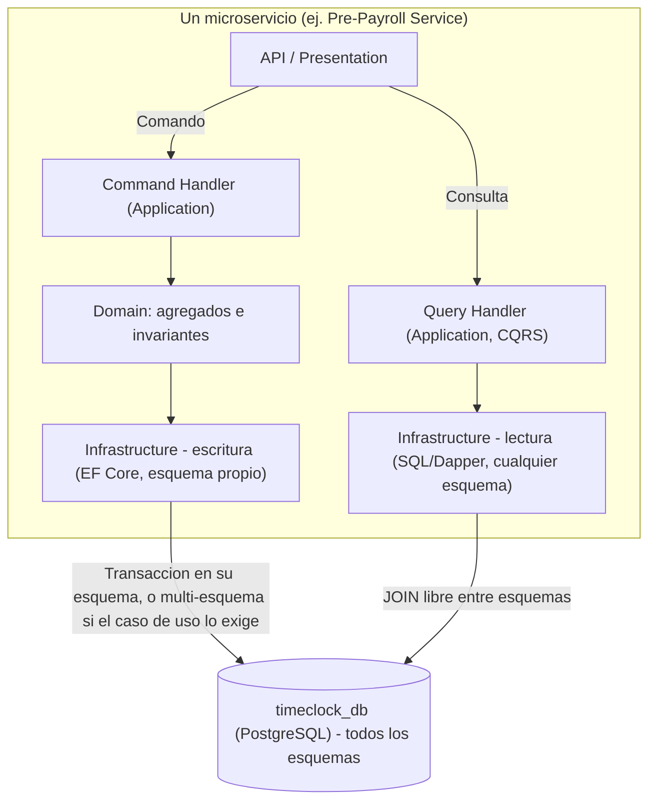

# ADR-001: Clean Architecture + CQRS con múltiples servicios y una única base de datos (vs. microservicios con bases de datos independientes)

| Campo | Valor |
|---|---|
| Estado | **Aceptado** |
| Fecha | 2026-09-22 |
| Autor | Software Architect |
| Sustituye a | Decisión implícita en `c4-containers.md` v2.0 (*database-per-service*) y v2.1 (base compartida con aislamiento por esquema/permisos) |
| Documentos relacionados | `docs/architecture/domain-model.md`, `docs/architecture/c4-containers.md` (v3.0) |

## Contexto

El Time Clock System se descompone en 9 bounded contexts (`domain-model.md`), cada uno cubriendo un subconjunto de las 14 historias de usuario (`docs/specs/functional/02-user-stories.md`): Identity, Clocking, Scheduling, Pre-Payroll, Absence Management, Employee Self-Service, Manager Self-Service, Integration y Audit. El requisito de arquitectura es que **cada bounded context se implemente como un servicio independientemente desplegable** (independencia de código, de release y de equipo).

La pregunta que resuelve este ADR es **cómo persisten los datos de esos servicios**, y se evaluó a lo largo de tres iteraciones documentadas en el historial de `c4-containers.md`:

- **v2.0 — Microservicios con base de datos por servicio** (*database-per-service*, el patrón canónico de microservicios): cada servicio con su propia instancia física de PostgreSQL.
- **v2.1 — Microservicios con base de datos compartida y aislamiento por esquema**: una sola instancia física, pero con un esquema y un rol de base de datos exclusivos por servicio, sin acceso entre esquemas.
- **v3.0 (esta decisión) — Múltiples servicios con Clean Architecture + CQRS y una única base de datos con acceso abierto entre esquemas.**

Características del dominio que pesan en esta decisión:

1. **Corrección financiera y legal crítica**: los cálculos de horas extra, recargos y saldos de vacaciones (US-006, US-007, US-008, US-009) tienen consecuencias directas en el pago de salarios y en el cumplimiento de legislación laboral. Un estado "aprobado pero el saldo no se actualizó todavía" — posible con consistencia eventual pura — no es aceptable como comportamiento normal del sistema.
2. **Lecturas transversales intensivas**: la tarjeta de asistencia (US-010), el panel de presencia (US-011) y la futura reportería/BI combinan datos de varios bounded contexts en casi todas sus consultas.
3. **Escala de equipo**: un número reducido de servicios/equipos, sin evidencia todavía de que algún bounded context necesite escalar su capa de datos de forma independiente al resto.
4. **9 servicios × 1 base de datos** ya es la arquitectura vigente (v2.1); la pregunta era si mantener el aislamiento por permisos entre esquemas aportaba un beneficio real dado que la base física ya es compartida.

## Decisión

Adoptamos:

1. **Múltiples servicios independientes**: uno por bounded context, cada uno con su propio código, pipeline de CI/CD y despliegue — sin cambios respecto de `c4-containers.md` §1.1.
2. **Clean Architecture dentro de cada servicio**: capas `Domain` (entidades y agregados con sus invariantes), `Application` (casos de uso / *handlers*), `Infrastructure` (EF Core, integraciones externas, consultas SQL) y `Presentation/API`. El dominio no depende de detalles de persistencia.
3. **CQRS (Command Query Responsibility Segregation)** como el patrón que decide *cómo* se accede a los datos:
   - **Comandos** (escrituras que aplican reglas de negocio) pasan por la capa `Application`/`Domain` del servicio dueño del agregado — en proceso si el caso de uso vive en ese mismo servicio, o vía su API si lo dispara otro servicio.
   - **Consultas** (lecturas, incluidas las que combinan varios bounded contexts) se implementan como SQL/Dapper o un `DbContext` de solo lectura que puede unir (`JOIN`) libremente tablas de cualquier esquema, sin pasar por la capa de dominio de otros servicios.
4. **Una única base de datos PostgreSQL compartida** (`timeclock_db`). Los esquemas (`identity`, `clocking`, `scheduling`, `prepayroll`, `absence`, `ess`, `mss`, `integration`, `audit`) son **una decisión de agrupamiento y legibilidad del modelo de datos, no de aislamiento**. Cualquier servicio puede acceder a cualquier esquema y cualquier tabla, y ejecutar transacciones que abarquen varios esquemas cuando el caso de uso lo requiera.

Se descarta explícitamente restringir el acceso entre esquemas mediante permisos de base de datos (`GRANT` por esquema): esa restricción existía en v2.1 y se elimina en esta decisión.

## Opciones consideradas

### Opción A (elegida) — Clean Architecture + CQRS, multi-servicio, base de datos única con acceso abierto

| | |
|---|---|
| **Aislamiento de despliegue/código** | Sí — cada servicio se compila, versiona y despliega por separado |
| **Aislamiento de datos** | No — deliberadamente; los esquemas agrupan, no aíslan |
| **Consistencia entre bounded contexts** | Inmediata cuando se necesita (transacción SQL local, sin 2PC) + eventual vía eventos para el resto |
| **Complejidad de consultas cruzadas** | Baja — `JOIN` SQL directo |
| **Costo de infraestructura de datos** | Una instancia de PostgreSQL |
| **Riesgo principal** | Disciplina de acceso depende de convención de equipo/revisión de código, no de un control técnico |

### Opción B (descartada) — Microservicios puros, base de datos por servicio (*database-per-service*, v2.0)

| | |
|---|---|
| **Aislamiento de despliegue/código** | Sí |
| **Aislamiento de datos** | Sí — total, a nivel de infraestructura |
| **Consistencia entre bounded contexts** | Solo eventual (sagas por coreografía o por orquestador) — sin transacciones ACID entre servicios |
| **Complejidad de consultas cruzadas** | Alta — composición de APIs o *event-carried state transfer* con proyecciones propias por servicio |
| **Costo de infraestructura de datos** | Una instancia de PostgreSQL por servicio (9 en este caso) |
| **Riesgo principal** | Sobre-ingeniería para el volumen y la escala actual del sistema; mayor tiempo de desarrollo para flujos que exigen consistencia inmediata (pre-nómina, saldos) |

### Opción C (descartada) — Microservicios, base de datos compartida con aislamiento por esquema/permisos (v2.1)

| | |
|---|---|
| **Aislamiento de despliegue/código** | Sí |
| **Aislamiento de datos** | Sí, a nivel de permisos (`GRANT` por esquema) — sin el costo de infraestructura de la Opción B |
| **Consistencia entre bounded contexts** | Solo eventual, igual que la Opción B, porque el aislamiento por permisos impide el `JOIN`/transacción directa que sí permitiría la misma instancia física |
| **Complejidad de consultas cruzadas** | Alta — misma limitación que la Opción B, pese a compartir la base de datos |
| **Costo de infraestructura de datos** | Una instancia de PostgreSQL |
| **Riesgo principal** | Combina el costo de disciplina de la Opción B (eventual consistency, proyecciones, sagas) con el acoplamiento físico de compartir una sola instancia — paga el precio de "microservicios estrictos" sin obtener a cambio la independencia de escalado de datos que los justificaría |

La Opción C se descarta por ser, en este contexto, la peor combinación: impone la disciplina operativa de los microservicios puros (eventos, proyecciones, sagas para toda consistencia entre contextos) sin ninguno de sus beneficios de aislamiento físico real, ya que de todas formas una falla o saturación de la única instancia de PostgreSQL afecta a los 9 servicios por igual.

## Consecuencias

### Positivas

- **Transacciones ACID reales entre bounded contexts** cuando la corrección de negocio lo exige (aprobar una solicitud y actualizar el saldo de vacaciones; cerrar un periodo de pre-nómina leyendo marcas y turnos) sin sagas, compensación ni 2PC — es una transacción local de un único motor de base de datos.
- **Consultas de reportería y proyecciones de lectura simples y de baja latencia** (`ESS Service`, `MSS Service`, BI) mediante SQL directo entre esquemas, sin depender de un pipeline de eventos ni de un data warehouse desde el primer día.
- **Menor costo operativo de datos**: una sola base de datos que respaldar, parchear, monitorear y escalar (verticalmente o con réplicas de lectura) en lugar de nueve.
- **La independencia que sí aporta valor se conserva íntegra**: despliegue independiente, releases independientes, aislamiento de fallas en cómputo/proceso, escalado horizontal de cómputo por servicio.
- **Clean Architecture mantiene las reglas de negocio encapsuladas en el código de cada bounded context** (capa `Application`/`Domain`), independientemente de que el acceso a la tabla no esté restringido a nivel de base de datos — la disciplina de "quién escribe qué" se aplica en el código, no en permisos.

### Negativas / riesgos aceptados

- **La base de datos compartida es un punto único de escalamiento y de falla** para la capa de datos de los 9 servicios. Mitigación: alta disponibilidad (réplica de conmutación), *connection pooling* (PgBouncer) y una réplica de solo lectura para las consultas intensivas (`c4-containers.md` §7).
- **Nada a nivel de base de datos impide que un servicio escriba por error en la tabla de otro bounded context**; la disciplina depende de convención de equipo, revisión de código y pruebas de integración, no de un control técnico como `GRANT`. Mitigación: todo comando que mute datos de otro bounded context documenta en el código por qué necesita hacerlo directamente (referencia a este ADR) y pasa por revisión.
- **Acopla más la evolución de esquema entre servicios**: un cambio de esquema en un servicio puede romper una consulta cruzada de otro. Mitigación: pruebas de integración que cubran las consultas/transacciones cruzadas conocidas (documentadas en `c4-containers.md` §5.3) y comunicación temprana de cambios entre equipos.
- **Migrar en el futuro a bases de datos físicamente separadas** (si un servicio concreto necesita escalar su capa de datos de forma independiente) exigirá primero identificar y eliminar los `JOIN`/transacciones cruzadas existentes. Se acepta como costo de una migración futura, no como bloqueador actual — es preferible pagar ese costo únicamente si y cuando un servicio concreto lo justifique con evidencia de carga, en vez de pagarlo por adelantado para los 9 servicios (que es lo que hacían las Opciones B y C).

## Notas de implementación

- **Estructura por servicio** (Clean Architecture): `Domain/` (agregados e invariantes de `domain-model.md`), `Application/` (Commands, Queries y sus *handlers*, p. ej. con MediatR), `Infrastructure/` (`DbContext` de escritura con `HasDefaultSchema` sobre el esquema principal del servicio; consultas de lectura con SQL/Dapper o un `DbContext` adicional de solo lectura que mapea las entidades de los esquemas que la consulta necesite), `Api/` (controladores/endpoints).
- **Toda consulta o transacción que cruce esquemas se declara explícitamente** en la capa `Infrastructure` del servicio que la ejecuta (no se "descubre" implícitamente vía navegación de EF Core entre `DbContext`s de distintos servicios), de modo que sea visible en la revisión de código y quede acotada a un archivo/clase concreto.
- **Los comandos que mutan un bounded context ajeno siguen invocando la capa `Application` del servicio dueño** (en proceso o vía su API — `c4-containers.md` §1.3, principio 3); el acceso SQL abierto no es un atajo para evitar esa capa en operaciones de escritura que aplican reglas de negocio de otro contexto.
- Los ejemplos concretos de este patrón en la arquitectura actual están documentados en `c4-containers.md` §5 (tabla de patrones de comunicación) y §5.3 (flujo de cierre de pre-nómina con `JOIN` directo entre `clocking`, `scheduling`, `absence` y `prepayroll`).

## Diagrama: capas del servicio y camino de comandos vs. consultas

## Referencias

- Robert C. Martin, *Clean Architecture* (2017).
- Greg Young, *CQRS Documents*; Martin Fowler, [*CQRS*](https://martinfowler.com/bliki/CQRS.html).
- Chris Richardson, patrón [*Database per Service*](https://microservices.io/patterns/data/database-per-service.html) (opción B, descartada).
- `docs/architecture/domain-model.md` §1, §11 — bounded contexts, agregados y eventos de dominio que este ADR no modifica.
- `docs/architecture/c4-containers.md` v3.0 — arquitectura de contenedores resultante de esta decisión.
