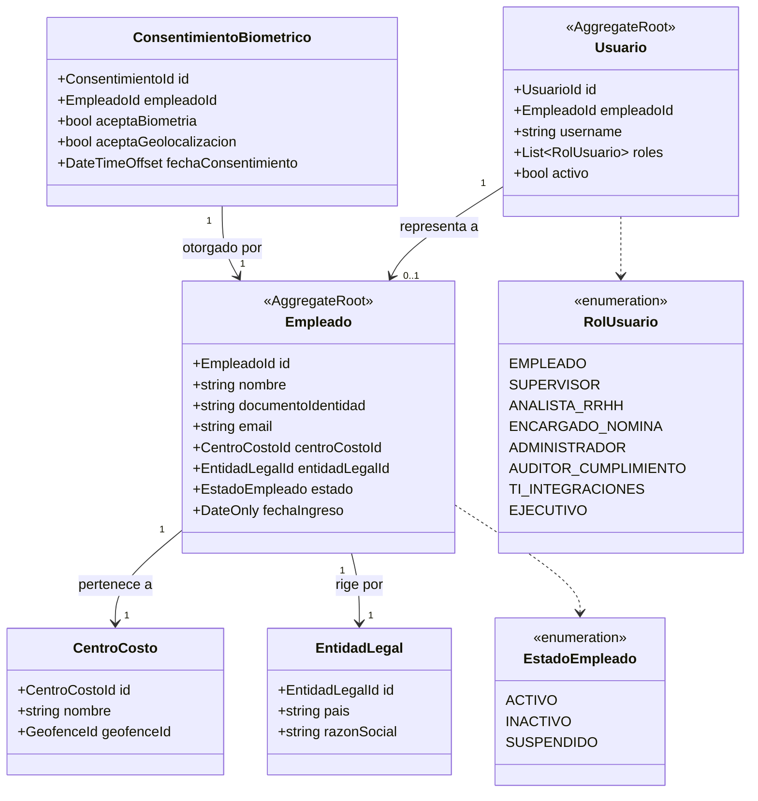
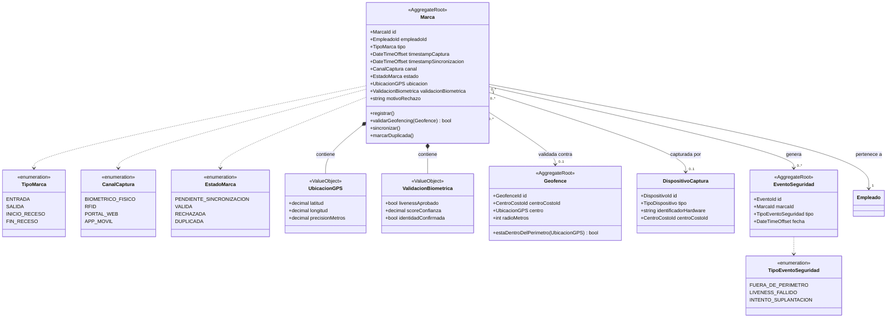
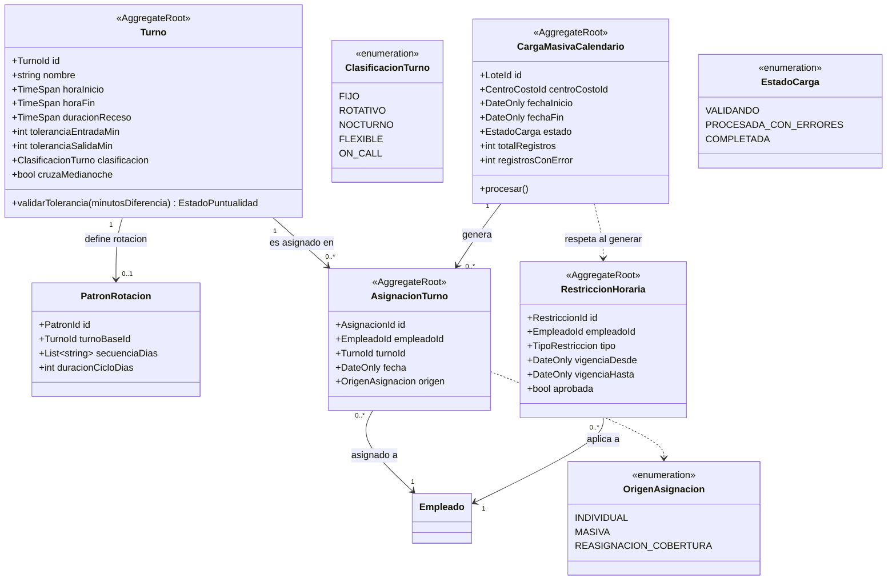
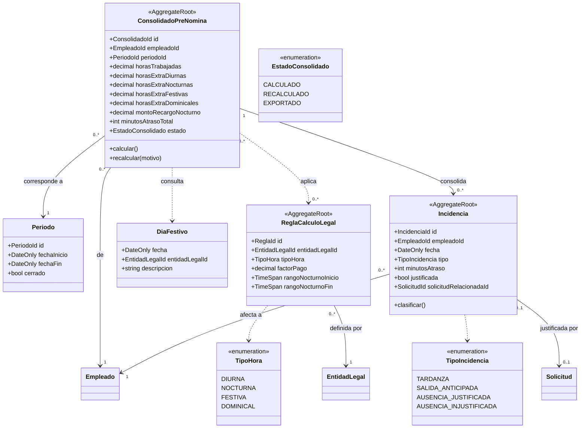
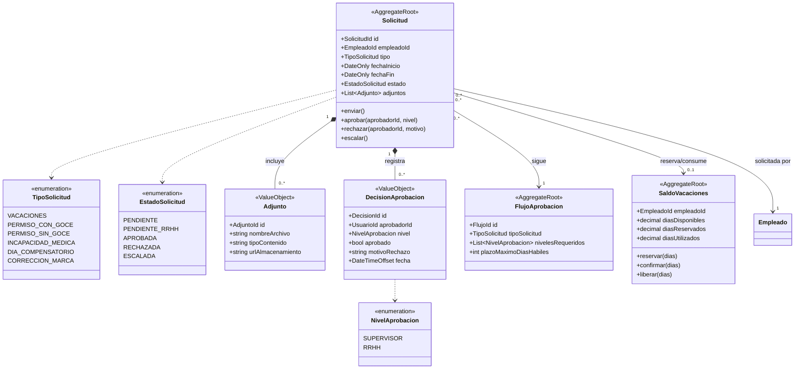
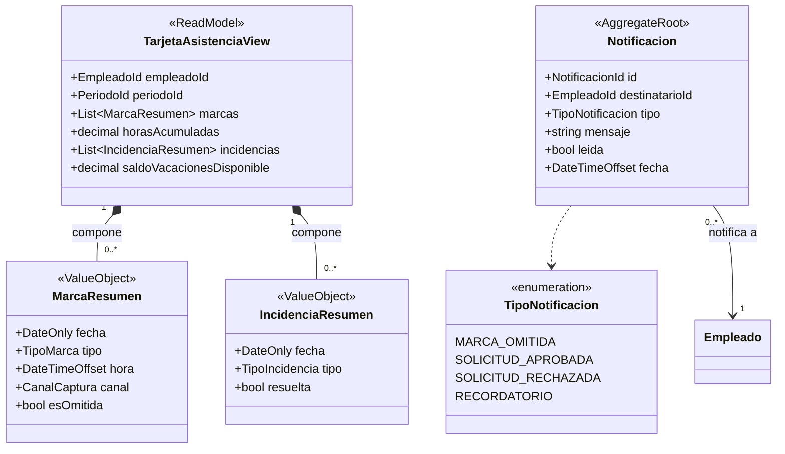
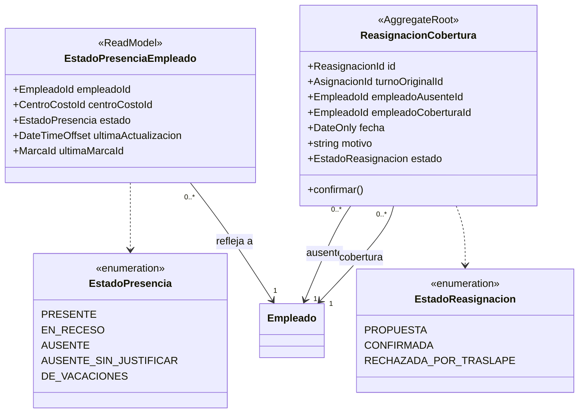
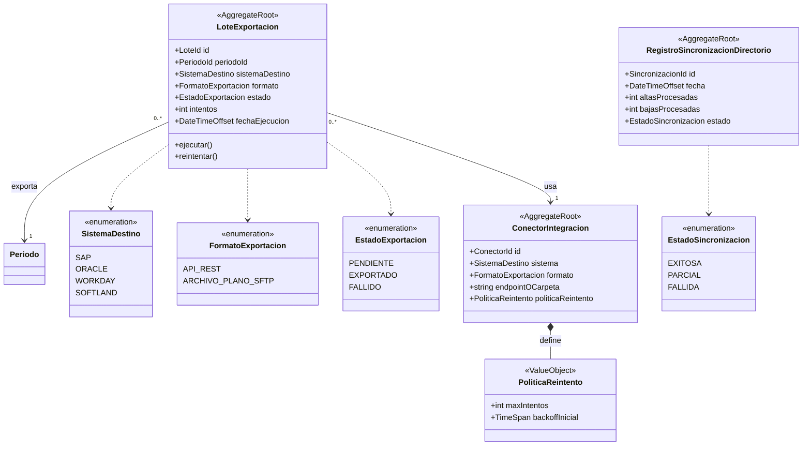
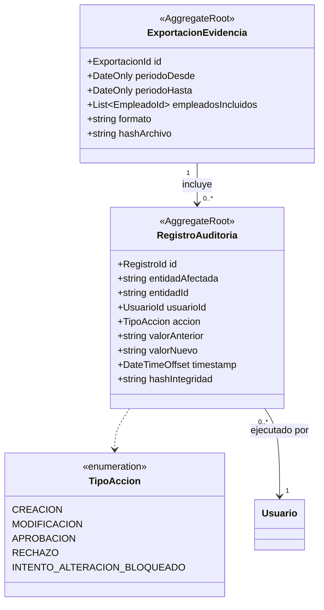
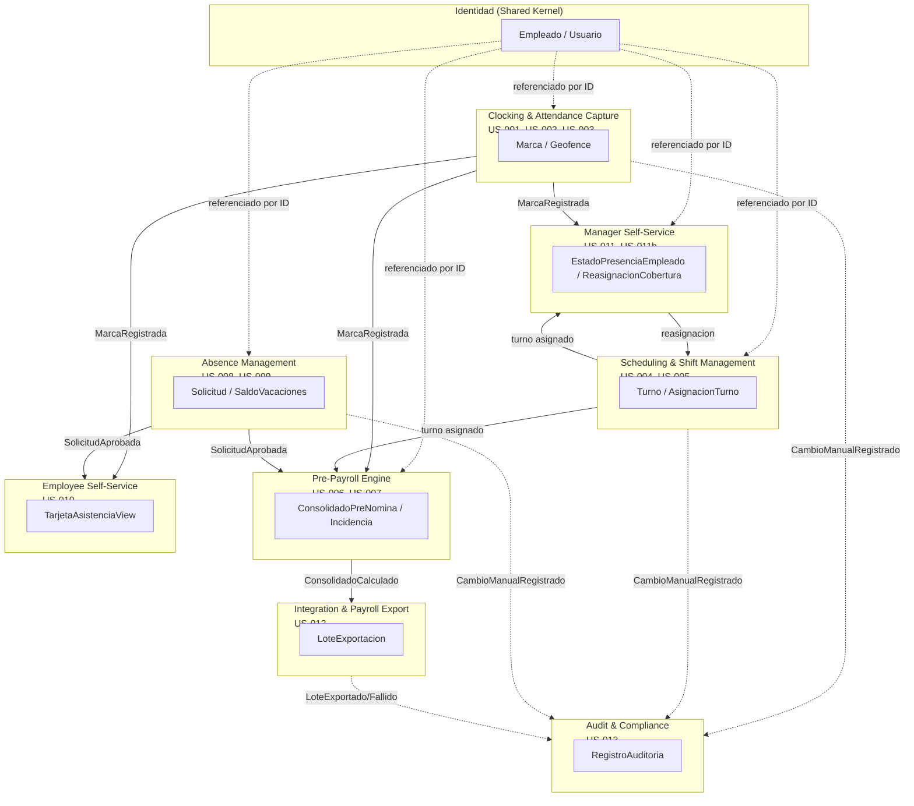

# Modelo de Dominio — Time Clock System

| Campo | Valor |
|---|---|
| Versión | 1.0 |
| Estado | Borrador para revisión |
| Autor | Software Architect |
| Fecha | 2026-09-21 |
| Insumos | `docs/specs/functional/01-vision-document.md`, `docs/specs/functional/02-user-stories.md` |

## 1. Enfoque

El dominio se modela con **Domain-Driven Design (DDD)**: se identifican **bounded contexts** alineados 1:1 con los módulos funcionales del documento de visión, cada uno con sus propios **aggregate roots**, invariantes y ciclo de vida. Los contextos no comparten entidades directamente entre sí — se referencian por **identidad (ID)** y se comunican mediante **eventos de dominio** (ver §11) — precisamente porque cada bounded context se implementa como un **microservicio independiente** (ver `c4-containers.md` §1), este desacoplamiento deja de ser una preferencia de diseño interno y pasa a ser un requisito de arquitectura de código: dos servicios en despliegues distintos se integran por red (API síncrona) o por mensajería (eventos asíncronos) para todo lo que sea **comando** (mutar el estado de otro contexto aplicando sus reglas de negocio).

Esto es independiente de que, a nivel de infraestructura, los servicios compartan una única base de datos física (`c4-containers.md` §1.2–§1.3, ver **ADR-001**) con acceso abierto entre esquemas: los esquemas son una agrupación lógica de tablas, no una frontera de aislamiento, y cualquier servicio puede leer, unir (`JOIN`) o incluso transaccionar directamente contra el esquema de otro cuando el caso de uso es una **consulta** (CQRS) o exige **consistencia atómica inmediata**. Lo que no cambia es quién es responsable de codificar las invariantes de cada agregado: ese acceso abierto se usa para leer o para transacciones puntuales de consistencia, nunca para que un servicio reimplemente en su propio código las reglas de negocio de un bounded context ajeno.

El **Identity Service** (§2) es quien posee los datos de **Empleado** y **Usuario**; los demás servicios no los duplican como fuente de verdad — los consumen por referencia (`EmpleadoId`) vía llamada síncrona a su API o mediante una réplica local de solo lectura mantenida por eventos (*Open Host Service* + *Published Language*, no un *shared kernel* de código compartido).

### 1.1 Convenciones de los diagramas

- `classDiagram` de Mermaid, un diagrama por bounded context.
- `<<AggregateRoot>>`: entidad raíz que garantiza sus invariantes y es la única puerta de entrada para modificar el agregado.
- `<<ValueObject>>`: objeto inmutable sin identidad propia, comparado por valor.
- `<<enumeration>>`: conjunto cerrado de valores.
- `-->`: asociación / referencia por ID hacia otro agregado.
- `*--`: composición (el value object no existe fuera del agregado que lo contiene).
- `..>`: dependencia de tipo (p. ej. un atributo tipado con un enum).

### 1.2 Trazabilidad Historia de Usuario → Bounded Context → Agregado

| Historia | Bounded Context | Agregado(s) raíz principal(es) |
|---|---|---|
| US-001 Marcaje Web/Móvil | Clocking & Attendance Capture (§3) | `Marca` |
| US-002 Marcaje Biométrico con Geofencing | Clocking & Attendance Capture (§3) | `Marca`, `Geofence` |
| US-003 Marcaje Offline y Sincronización | Clocking & Attendance Capture (§3) | `Marca` |
| US-004 Configuración de Turnos Rotativos y Fijos | Scheduling & Shift Management (§4) | `Turno` |
| US-005 Asignación Masiva de Calendarios | Scheduling & Shift Management (§4) | `CargaMasivaCalendario`, `AsignacionTurno` |
| US-006 Cálculo Automático de Horas Extra y Recargos | Pre-Payroll Engine (§5) | `ConsolidadoPreNomina` |
| US-007 Detección Automática de Tardanzas y Ausencias | Pre-Payroll Engine (§5) | `Incidencia` |
| US-008 Solicitud de Permisos y Vacaciones | Absence Management (§6) | `Solicitud`, `SaldoVacaciones` |
| US-009 Aprobación de Incidencias por Jefatura | Absence Management (§6) | `Solicitud`, `DecisionAprobacion` |
| US-010 Consulta de Tarjeta de Asistencia | Employee Self-Service (§7) | `TarjetaAsistenciaView` (read model) |
| US-011 Monitor de Presencia en Tiempo Real | Manager Self-Service (§8) | `EstadoPresenciaEmpleado` (read model) |
| US-011b Reasignación Rápida de Turnos | Manager Self-Service (§8) | `ReasignacionCobertura` |
| US-012 Exportación e Integración con Sistema de Nómina | Integration & Payroll Export (§9) | `LoteExportacion` |
| US-013 Bitácora de Auditoría | Audit & Compliance (§10) | `RegistroAuditoria` |

## 2. Identity Service — Contexto de Identidad (Open Host Service)

Microservicio dueño de `Empleado` y `Usuario`. Los demás servicios lo consumen por referencia (`EmpleadoId`, `UsuarioId`), ya sea mediante llamada síncrona a su API o suscribiéndose al evento `EmpleadoSincronizado` (§11) para mantener una proyección local de solo lectura; en ningún caso otro servicio escribe estos datos.

**Notas de diseño:**
- `Usuario` (identidad de acceso/RBAC) se modela separado de `Empleado` (sujeto de control de asistencia): un supervisor o auditor puede no estar sujeto a marcaje, y un mismo `Empleado` puede tener cero o un `Usuario` asociado.
- `ConsentimientoBiometrico` es prerrequisito de negocio para que `Marca` (§3) acepte captura biométrica o geolocalización, en línea con el principio de "privacidad por diseño" del documento de visión.

## 3. Clocking & Attendance Capture — US-001, US-002, US-003

**Invariantes clave (trazadas a criterios de aceptación):**
- Una `Marca` de tipo `ENTRADA` no puede registrarse si el empleado ya tiene una `ENTRADA` sin `SALIDA` de cierre (US-001, escenario "Intento de doble marca de entrada").
- Una `Marca` capturada por canal `BIOMETRICO_FISICO` o `APP_MOVIL` con geolocalización requiere `ValidacionBiometrica.livenessAprobado = true` antes de evaluar `Geofence`; si falla, la marca pasa a `RECHAZADA` y genera `EventoSeguridad` (US-002).
- Una `Marca` en estado `PENDIENTE_SINCRONIZACION` conserva `timestampCaptura` (hora local del dispositivo) distinto de `timestampSincronizacion`; las reglas de negocio (geofencing, turno, duplicados) se evalúan contra `timestampCaptura` (US-003).
- La sincronización debe detectar y descartar duplicados (mismo `empleadoId` + `tipo` + `timestampCaptura` ya persistido) sin doble conteo de horas (US-003).

## 4. Scheduling & Shift Management — US-004, US-005

**Invariantes clave:**
- `toleranciaEntradaMin`/`toleranciaSalidaMin` deben estar en el rango `[0, duración del turno]`; un valor negativo o excesivo se rechaza en la configuración (US-004).
- Un `Turno` con `cruzaMedianoche = true` distribuye las horas trabajadas entre dos fechas calendario y marca el segmento nocturno para efectos de recargo, consumido por `ReglaCalculoLegal` (§5) (US-004).
- `CargaMasivaCalendario.procesar()` genera una `AsignacionTurno` por empleado del alcance, **excepto** para empleados con `RestriccionHoraria` activa y aprobada vigente en el rango de fechas, que se excluyen o ajustan automáticamente (US-005).

## 5. Pre-Payroll Engine — US-006, US-007

> `Solicitud` pertenece al contexto **Absence Management** (§6) y se referencia aquí únicamente por `SolicitudId` — el motor de pre-nómina no es dueño de su ciclo de vida, solo consulta si existe una aprobación vigente para la fecha de la incidencia.

**Invariantes clave:**
- Los factores de `ReglaCalculoLegal` son datos de configuración por `EntidadLegal`, nunca lógica embebida, permitiendo distintos porcentajes de recargo por país/entidad (US-006).
- Una jornada en fecha presente en `DiaFestivo` clasifica **todas** las horas trabajadas ese día como `FESTIVA`, con su propio factor de pago (US-006).
- `Incidencia.minutosAtraso` se calcula descontando la tolerancia del `Turno` asignado; un ingreso dentro de tolerancia no genera `Incidencia` (US-007).
- El cierre diario clasifica una ausencia como `AUSENCIA_JUSTIFICADA` únicamente si existe una `Solicitud` aprobada vigente para esa fecha; en caso contrario, `AUSENCIA_INJUSTIFICADA` y notifica al supervisor (US-007).
- Toda aprobación tardía de una `Solicitud` que afecta un `Periodo` ya calculado dispara `ConsolidadoPreNomina.recalcular()`, dejando trazabilidad del motivo.

## 6. Absence Management — US-008, US-009

**Invariantes clave:**
- `Solicitud.enviar()` para `TipoSolicitud.VACACIONES` valida `SaldoVacaciones.diasDisponibles >= diasSolicitados` antes de crear la solicitud; si se aprueba, pasa de reservado a utilizado, si se rechaza, se libera la reserva (US-008).
- `Solicitud` de tipo `INCAPACIDAD_MEDICA` exige al menos un `Adjunto` antes de permitir `enviar()` (US-008).
- El número de `NivelAprobacion` requeridos y sus roles participantes provienen de `FlujoAprobacion`, configurable por `TipoSolicitud` y unidad organizativa — no está codificado en `Solicitud` (US-009).
- Si el tiempo transcurrido desde la creación supera `FlujoAprobacion.plazoMaximoDiasHabiles` sin decisión, `Solicitud.escalar()` cambia el estado y notifica al siguiente nivel (US-009).
- Toda `DecisionAprobacion` (aprobación o rechazo) es inmutable una vez registrada y alimenta la Bitácora de Auditoría (§10).

## 7. Employee Self-Service (ESS) — US-010

Contexto de **solo lectura** (read model / CQRS query side): compone datos de `Marca` (§3), `Incidencia` (§5), `Turno` (§4) y `SaldoVacaciones` (§6) sin ser dueño de ninguno.

**Invariantes clave:**
- `TarjetaAsistenciaView` se reconstruye de forma casi en tiempo real ante cada evento `MarcaRegistrada` o `IncidenciaClasificada` (§11), reflejando incidencias aún no resueltas por RRHH (US-010).
- `MarcaResumen.esOmitida = true` quando un turno asignado no tiene su marca de cierre correspondiente registrada, habilitando al empleado a iniciar una `Solicitud` de tipo `CORRECCION_MARCA` desde la misma vista (US-010).

## 8. Manager Self-Service (MSS) — US-011, US-011b

**Invariantes clave:**
- `EstadoPresenciaEmpleado` se actualiza por push ante cada evento `MarcaRegistrada` (§11), sin requerir recarga de página; el filtrado por centro de costo opera sobre esta proyección (US-011).
- Un empleado con turno iniciado hace más de 30 minutos sin `Marca` de entrada y sin `Solicitud` aprobada vigente se proyecta como `AUSENTE_SIN_JUSTIFICAR` (US-011).
- `ReasignacionCobertura.confirmar()` valida que `empleadoCoberturaId` no tenga ya una `AsignacionTurno` (§4) en el mismo horario; de existir traslape, exige confirmación explícita del supervisor antes de persistir (US-011b).
- Toda `ReasignacionCobertura` queda vinculada al evento de ausencia que la originó para trazabilidad en reportes de cobertura (US-011b).

## 9. Integration & Payroll Export — US-012

**Invariantes clave:**
- Cada `LoteExportacion` tiene un identificador único trazable end-to-end hacia el ERP destino; el estado solo transiciona `PENDIENTE → EXPORTADO` o `PENDIENTE → FALLIDO` tras agotar `PoliticaReintento.maxIntentos` (US-012).
- `RegistroSincronizacionDirectorio` es la fuente autoritativa de altas/bajas de `Empleado`: mientras esté activa, el TCS no permite creación manual de empleados (US-012, ver también §2).

## 10. Audit & Compliance — US-013 (contexto transversal)

**Invariantes clave (append-only por diseño):**
- `RegistroAuditoria` **no expone operaciones de actualización ni borrado**, ni siquiera a nivel administrativo; solo `registrar()` (inserción) y consultas de lectura (US-013).
- Todo cambio manual sobre `Marca`, `AsignacionTurno` o `Solicitud` genera un `RegistroAuditoria` de forma síncrona a la operación que lo origina, nunca diferida (US-013).
- `ExportacionEvidencia.hashArchivo` permite verificar la integridad del archivo exportado ante una inspección laboral (US-013).
- Este contexto es **transversal**: todos los demás contextos publican eventos de cambio manual hacia él (ver §11), pero él nunca depende de ellos.

## 11. Eventos de dominio entre contextos

Los bounded contexts se mantienen desacoplados y se comunican mediante eventos de dominio (publicados por el agregado que los origina, consumidos por los contextos interesados). Como cada contexto es un microservicio independiente (`c4-containers.md` §1), estos eventos ya no son un detalle interno de implementación sino **contratos de integración entre servicios**, publicados y consumidos a través del bus de eventos compartido (Redis) descrito en `c4-containers.md` §5.

| Evento | Publicado por | Consumido por | Efecto |
|---|---|---|---|
| `MarcaRegistrada` | Clocking (§3) | Manager Self-Service (§8), Employee Self-Service (§7), Pre-Payroll (§5) | Actualiza `EstadoPresenciaEmpleado`; recalcula `TarjetaAsistenciaView`; insumo para cierre diario |
| `MarcaRechazada` | Clocking (§3) | Audit (§10) | Registra intento de fraude/geofencing como evento de seguridad |
| `CierreDiarioEjecutado` | Pre-Payroll (§5) | Absence Management (§6), Employee/Manager SS (§7, §8) | Clasifica ausencias; actualiza vistas de presencia e incidencias |
| `SolicitudAprobada` / `SolicitudRechazada` | Absence Management (§6) | Pre-Payroll (§5), Employee Self-Service (§7) | Marca `Incidencia.justificada`; dispara `recalcular()` si el periodo ya fue calculado; actualiza `SaldoVacaciones` |
| `ConsolidadoCalculado` | Pre-Payroll (§5) | Integration (§9), Reportes/BI | Habilita el `LoteExportacion` del periodo |
| `LoteExportado` / `LoteFallido` | Integration (§9) | Audit (§10) | Trazabilidad de exportaciones hacia el ERP |
| `AltaBajaDetectada` (comando síncrono, no evento) | Integration (§9) → Identidad (§2) | Identidad (§2) | Integration detecta el cambio en el directorio activo y ordena la creación/baja; Identidad es la única que escribe `Empleado`/`Usuario` |
| `EmpleadoSincronizado` (alta/baja) | Identidad (§2) | Todos los demás contextos | Publicado por Identidad tras persistir el alta/baja; actualiza las proyecciones locales de `EmpleadoId` en cada contexto |
| `CambioManualRegistrado` | Cualquier contexto (Clocking, Scheduling, Absence) | Audit (§10) | Inserción síncrona de `RegistroAuditoria` |

## 12. Mapa de bounded contexts

> Cada subgrafo de este mapa es un **servicio desplegable independiente** (ver el mapeo 1:1 en `c4-containers.md` §2–§3). Las flechas sólidas representan eventos de dominio publicados de forma asíncrona a través del bus de eventos compartido (Redis); las flechas punteadas hacia `Identity` representan una llamada síncrona a su API o una réplica local mantenida por el evento `EmpleadoSincronizado`.

## 13. Documentos relacionados

- `docs/specs/functional/02-user-stories.md` — Historias de usuario e insumo funcional de este modelo.
- `docs/architecture/c4-containers.md` — Arquitectura de contenedores (C4) que implementa estos bounded contexts.
- `docs/architecture/decisions/ADR-001-clean-architecture-cqrs-vs-microservicios-multiples-bd.md` — Justificación de por qué los servicios comparten una única base de datos con acceso abierto entre esquemas.
