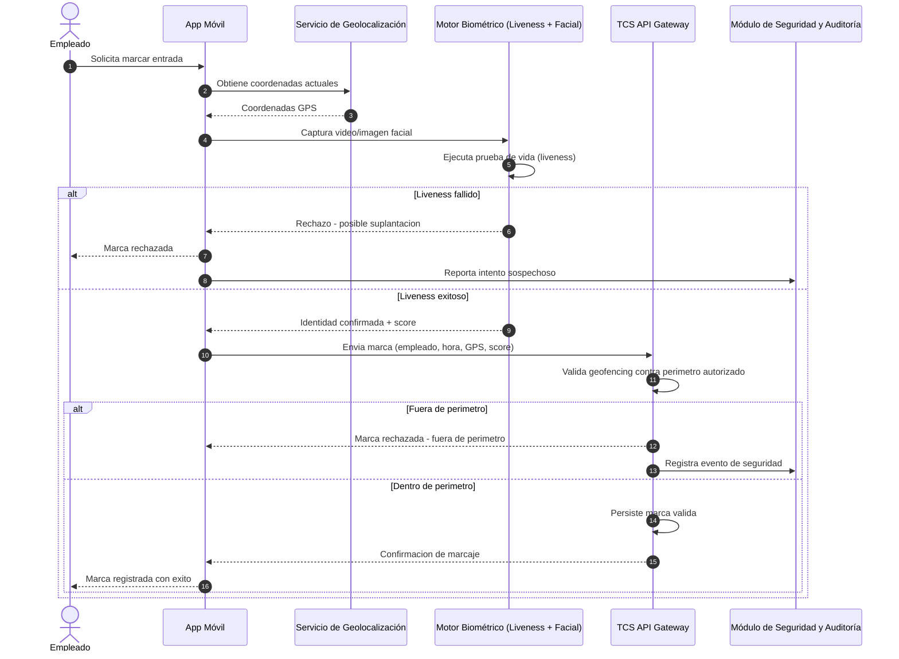
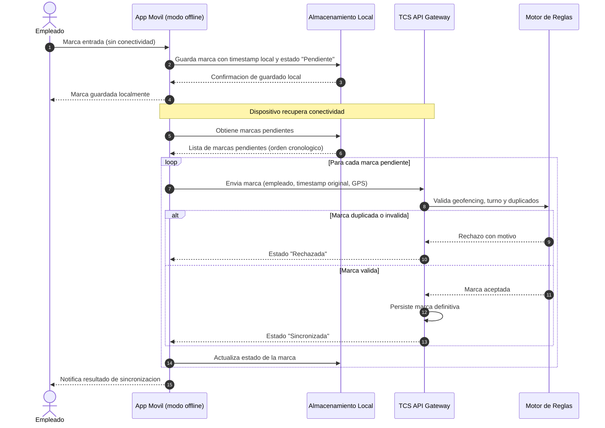
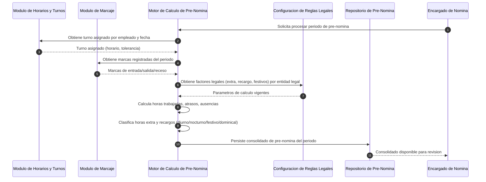
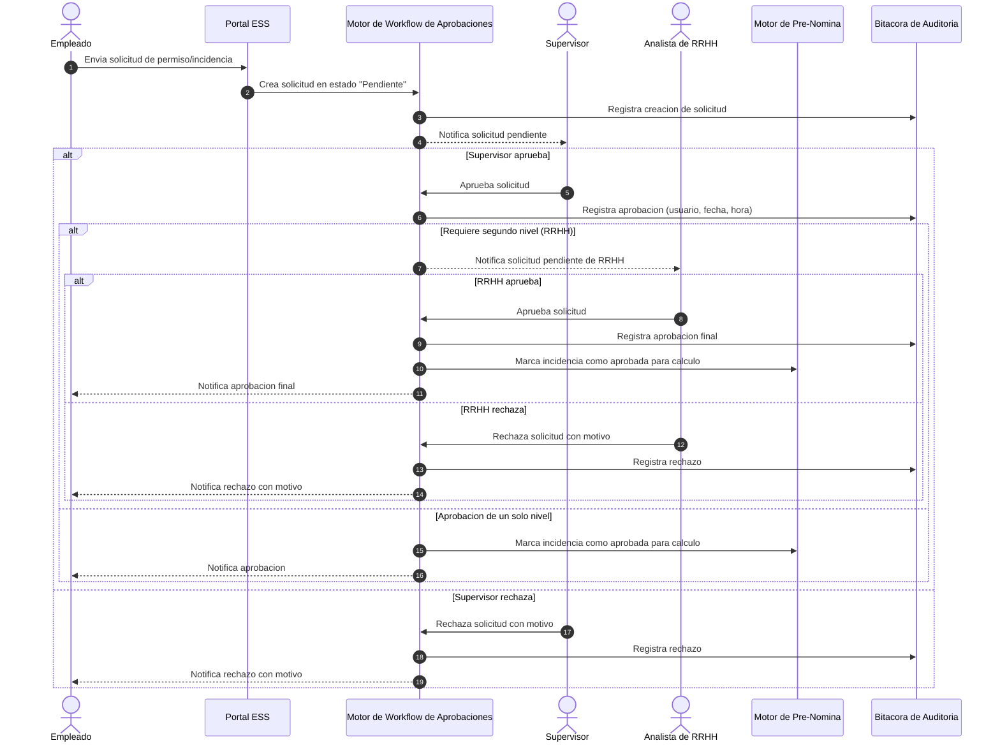
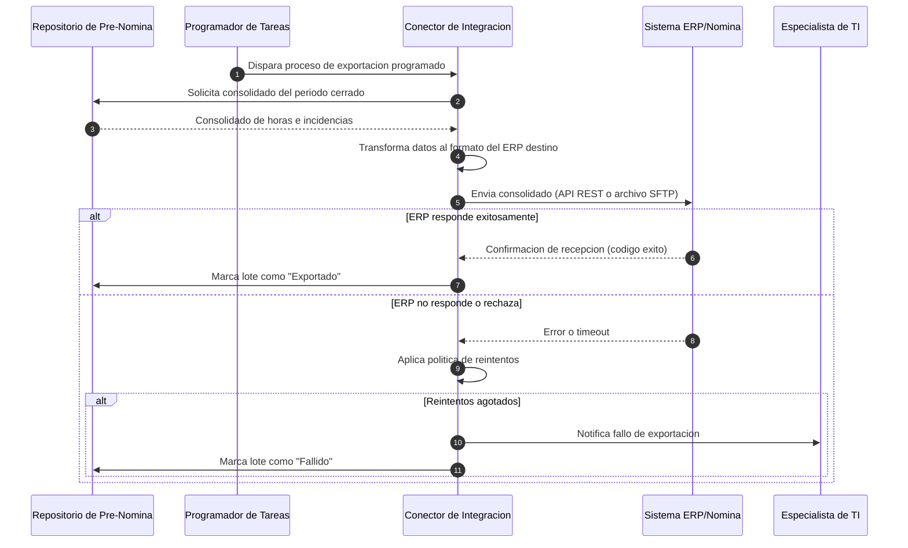
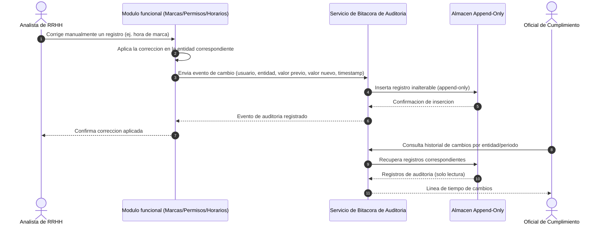

# Historias de Usuario — Time Clock System

| Campo | Valor |
|---|---|
| Versión | 1.0 |
| Estado | Borrador para revisión |
| Autor | Lead Requirements Engineer |
| Fecha | 2026-09-21 |
| Referencia | Ver `01-vision-document.md` para objetivos y perfiles de usuario |

Convenciones:
- Formato de criterios de aceptación: **Gherkin** (`Given` / `When` / `Then`).
- Cada historia incluye: descripción, criterios de aceptación, reglas de negocio clave y, cuando el flujo lo amerita, un diagrama de secuencia en Mermaid.
- IDs de historia estables (`US-00X`) para trazabilidad hacia pruebas y tareas de desarrollo.

---

## 2.1 Módulo de Registro y Captura de Marcas (Clocking)

### US-001: Marcaje Web/Móvil

**Como** empleado de campo o teletrabajador,
**quiero** registrar mi marca de entrada y salida desde la app móvil o el portal web,
**para** validar mi jornada laboral sin estar físicamente en la oficina.

```gherkin
Feature: Marcaje desde canal Web/Móvil

  Scenario: Registro exitoso de marca de entrada desde la app móvil
    Given el empleado tiene sesión iniciada en la app móvil
    And el empleado no tiene una marca de entrada abierta en el turno actual
    When el empleado presiona "Marcar Entrada"
    Then el sistema registra la marca con fecha, hora y canal "App Móvil"
    And el sistema muestra una confirmación visual con la hora registrada

  Scenario: Registro exitoso de marca de salida desde el portal web
    Given el empleado tiene una marca de entrada abierta
    When el empleado presiona "Marcar Salida" desde el portal web
    Then el sistema registra la marca de salida con fecha, hora y canal "Portal Web"
    And el sistema calcula el tiempo transcurrido desde la entrada

  Scenario: Intento de doble marca de entrada
    Given el empleado ya tiene una marca de entrada abierta sin salida registrada
    When el empleado intenta marcar entrada nuevamente
    Then el sistema rechaza la operación
    And el sistema muestra el mensaje "Ya existe una entrada abierta, registre su salida primero"
```

**Reglas de negocio:**
- Toda marca queda asociada a: empleado, fecha/hora UTC, canal de captura, y (si aplica) coordenadas GPS.
- El sistema no permite dos marcas del mismo tipo consecutivas sin su contraparte (entrada sin salida previa cerrada).

### US-002: Marcaje Biométrico con Geofencing

**Como** administrador del sistema,
**quiero** definir perímetros geográficos (geofencing) y validación facial para los marcajes,
**para** evitar suplantaciones de identidad y asegurar que los registros se realicen en ubicaciones autorizadas.

```gherkin
Feature: Marcaje biométrico con validación de geofencing y liveness

  Scenario: Marca válida dentro del perímetro autorizado con reconocimiento facial exitoso
    Given el empleado tiene configurado un geofence de 150 metros alrededor de su centro de trabajo
    And el empleado se encuentra dentro del perímetro autorizado
    When el empleado realiza el marcaje mediante reconocimiento facial
    And la prueba de vida (liveness detection) confirma que es una persona real
    And el motor de reconocimiento facial confirma una coincidencia de identidad válida
    Then el sistema registra la marca como válida
    And el sistema almacena las coordenadas GPS y el score de confianza biométrica

  Scenario: Intento de marcaje fuera del perímetro autorizado
    Given el empleado tiene configurado un geofence para su centro de trabajo
    And el empleado se encuentra a 500 metros fuera del perímetro autorizado
    When el empleado intenta marcar asistencia
    Then el sistema rechaza la marca
    And el sistema notifica al supervisor sobre el intento fuera de perímetro
    And el sistema registra el intento fallido en la bitácora de seguridad

  Scenario: Intento de suplantación detectado por liveness detection
    Given el empleado intenta marcar usando reconocimiento facial
    When el sistema detecta que la imagen proviene de una fotografía o video (no persona en vivo)
    Then el sistema rechaza el marcaje
    And el sistema clasifica el intento como "posible fraude"
    And el sistema notifica al administrador de seguridad
```

**Reglas de negocio:**
- El geofence se configura por centro de trabajo, empleado o grupo, con un radio en metros parametrizable.
- Todo rechazo por geofencing o liveness genera un evento de seguridad auditable (ver Módulo 9).

**Diagrama de secuencia:**



### US-003: Marcaje Offline y Sincronización

**Como** empleado en zonas con baja conectividad,
**quiero** registrar mi asistencia de manera offline en la app,
**para** que mis marcas se sincronicen automáticamente cuando vuelva a tener red.

```gherkin
Feature: Captura offline y sincronizacion automatica de marcas

  Scenario: Registro de marca sin conexion a internet
    Given el empleado no tiene conectividad a internet
    When el empleado registra una marca de entrada desde la app movil
    Then el sistema almacena la marca localmente en el dispositivo con estado "Pendiente de sincronizacion"
    And el sistema muestra al empleado un indicador de "marca guardada localmente"

  Scenario: Sincronizacion automatica al recuperar conectividad
    Given el empleado tiene una o mas marcas pendientes de sincronizacion almacenadas localmente
    When el dispositivo recupera conectividad a internet
    Then la app sincroniza automaticamente las marcas pendientes con el servidor en orden cronologico
    And el servidor aplica las validaciones de geofencing y reglas de negocio correspondientes a la hora original de captura
    And el estado de cada marca cambia a "Sincronizada" o "Rechazada" segun el resultado de la validacion

  Scenario: Conflicto de sincronizacion por marca duplicada
    Given una marca fue capturada offline con la misma hora y tipo de una marca ya sincronizada previamente desde otro dispositivo
    When la app intenta sincronizar la marca offline
    Then el sistema detecta el duplicado
    And el sistema descarta la marca duplicada sin generar doble conteo de horas
    And el sistema notifica al empleado sobre el duplicado descartado
```

**Reglas de negocio:**
- Las marcas offline conservan el timestamp de captura local (con offset de zona horaria del dispositivo), no el timestamp de sincronización.
- La validación de reglas de negocio (geofencing, tolerancia, turnos) se aplica al momento de sincronizar, usando el timestamp original.

**Diagrama de secuencia:**



---

## 2.2 Módulo de Gestión de Horarios y Turnos (Scheduling)

### US-004: Configuración de Turnos Rotativos y Fijos

**Como** analista de Recursos Humanos,
**quiero** definir plantillas de turnos (fijos, nocturnos, rotativos) con reglas de margen/tolerancia,
**para** adaptarme a los esquemas operativos de cada departamento.

```gherkin
Feature: Configuracion de catalogo de turnos

  Scenario: Creacion de un turno fijo diurno con tolerancia
    Given el analista de RRHH accede al catalogo de turnos
    When crea un turno "Administrativo 08:00-17:00" con 10 minutos de tolerancia de entrada
    Then el sistema guarda el turno como disponible para asignacion
    And el sistema aplica la tolerancia configurada en el calculo de atrasos para ese turno

  Scenario: Creacion de un turno nocturno que cruza medianoche
    Given el analista de RRHH crea un turno "Nocturno 22:00-06:00"
    When el turno es asignado a un empleado
    Then el sistema calcula correctamente las horas trabajadas distribuidas entre dos dias calendario
    And el sistema marca las horas comprendidas en el rango nocturno legal para efectos de recargo

  Scenario: Creacion de un turno rotativo con patron de rotacion
    Given el analista de RRHH define un turno rotativo con patron "Manana-Tarde-Noche-Descanso" de 4 dias
    When el patron se activa para un grupo de empleados a partir de una fecha
    Then el sistema genera automaticamente el calendario proyectado de cada empleado segun el patron
    And el sistema permite visualizar la proyeccion de turnos futuros por empleado

  Scenario: Intento de crear un turno con tolerancia invalida
    Given el analista de RRHH esta creando un nuevo turno
    When ingresa un valor de tolerancia negativo o mayor a la duracion del turno
    Then el sistema rechaza la configuracion
    And el sistema muestra un mensaje de validacion indicando el rango permitido
```

**Reglas de negocio:**
- Un turno se define por: hora de inicio, hora de fin, duración de receso, tolerancia de entrada/salida, y clasificación (fijo, rotativo, nocturno, flexible, on-call).
- Los turnos nocturnos que cruzan medianoche prorratean las horas trabajadas entre los dos días calendario correspondientes.

### US-005: Asignación Masiva de Calendarios

**Como** supervisor de área,
**quiero** asignar calendarios y turnos a un grupo de empleados de forma masiva,
**para** optimizar el tiempo de planificación semanal o mensual.

```gherkin
Feature: Asignacion masiva de turnos y calendarios

  Scenario: Asignacion masiva exitosa por departamento
    Given el supervisor selecciona el departamento "Logistica" con 25 empleados activos
    When asigna el turno "Rotativo Logistica" para el periodo del mes siguiente
    Then el sistema asigna el turno a los 25 empleados seleccionados
    And el sistema muestra un resumen de la asignacion con la cantidad de empleados afectados

  Scenario: Asignacion masiva con excepciones individuales
    Given el supervisor realiza una asignacion masiva de turno a un grupo de empleados
    And 2 de los empleados tienen una restriccion de horario aprobada (ej. lactancia, condicion medica)
    When el supervisor confirma la asignacion masiva
    Then el sistema aplica el turno estandar a los empleados sin restriccion
    And el sistema excluye o ajusta automaticamente a los empleados con restriccion activa
    And el sistema notifica al supervisor sobre las excepciones aplicadas

  Scenario: Carga masiva de calendarios mediante archivo
    Given el supervisor descarga la plantilla de carga masiva de calendarios
    When sube un archivo con la asignacion de turnos por empleado y fecha
    Then el sistema valida el formato y los identificadores de empleado
    And el sistema muestra un reporte de filas procesadas exitosamente y filas con error antes de confirmar la carga
```

**Reglas de negocio:**
- La asignación masiva debe respetar restricciones individuales previamente aprobadas (Módulo 4) sin requerir reconfiguración manual.
- Toda asignación masiva queda registrada en la bitácora de auditoría con el usuario ejecutor y el alcance (empleados afectados).

---

## 2.3 Módulo de Pre-Nómina y Motor de Reglas (Pre-Payroll Engine)

### US-006: Cálculo Automático de Horas Extra y Recargos

**Como** encargado de nómina,
**quiero** que el sistema clasifique automáticamente las horas extra (diurnas, nocturnas, festivas) y recargos según la legislación local,
**para** reducir inconsistencias y tiempo en el procesamiento de salarios.

```gherkin
Feature: Calculo automatico de horas extra y recargos

  Scenario: Clasificacion de horas extra diurnas
    Given un empleado tiene un turno de 8 horas de 08:00 a 17:00
    And el empleado registra marcas de 08:00 a 19:00
    When el motor de calculo procesa la jornada
    Then el sistema calcula 2 horas extra diurnas
    And el sistema aplica el factor de pago configurado para horas extra diurnas

  Scenario: Clasificacion de horas extra en dia festivo
    Given la fecha del turno corresponde a un dia festivo configurado en el calendario legal
    And el empleado registra marcas completas de su turno asignado
    When el motor de calculo procesa la jornada
    Then el sistema clasifica todas las horas trabajadas ese dia como "Horas festivas"
    And el sistema aplica el factor de recargo festivo configurado para la entidad legal correspondiente

  Scenario: Clasificacion de horas extra nocturnas dentro de un turno diurno extendido
    Given un empleado con turno diurno permanece trabajando mas alla de las 22:00
    When el motor de calculo procesa la jornada
    Then las horas trabajadas despues de las 22:00 se clasifican como "Horas extra nocturnas"
    And se aplica el factor combinado de hora extra y recargo nocturno segun configuracion legal

  Scenario: Reglas parametrizables por pais o entidad legal
    Given dos entidades legales de la organizacion tienen porcentajes distintos de recargo por hora extra festiva
    When el motor de calculo procesa jornadas de empleados de ambas entidades
    Then el sistema aplica el porcentaje de recargo configurado para la entidad legal correspondiente a cada empleado
```

**Reglas de negocio:**
- Los factores de cálculo (porcentaje de recargo por tipo de hora) son parametrizables por entidad legal/país, no están fijos en el código (ver `01-vision-document.md` §4.2).
- El motor recalcula automáticamente cuando se aprueba una corrección de marca o una incidencia que afecta el periodo ya procesado, dejando trazabilidad del recálculo.

**Diagrama de secuencia:**



### US-007: Detección Automática de Tardanzas y Ausencias

**Como** analista de Recursos Humanos,
**quiero** que el motor identifique inmediatamente cuando un empleado sobrepase la tolerancia de llegada o no presente marcas,
**para** aplicar los descuentos o alertas oportunas.

```gherkin
Feature: Deteccion automatica de tardanzas y ausencias

  Scenario: Deteccion de tardanza fuera de tolerancia
    Given el empleado tiene un turno de 08:00 con 10 minutos de tolerancia
    When el empleado marca su entrada a las 08:16
    Then el sistema clasifica la marca como "Tardanza"
    And el sistema calcula el minutaje de atraso descontando la tolerancia

  Scenario: Marca dentro del margen de tolerancia
    Given el empleado tiene un turno de 08:00 con 10 minutos de tolerancia
    When el empleado marca su entrada a las 08:07
    Then el sistema no genera incidencia de tardanza

  Scenario: Ausencia por falta de marcas
    Given el empleado tiene un turno asignado para el dia actual
    And no existe ninguna marca de entrada registrada para ese turno al cierre del dia
    And no existe una justificacion o permiso aprobado para esa fecha
    When el proceso de cierre diario se ejecuta
    Then el sistema clasifica el dia como "Ausencia injustificada"
    And el sistema notifica al supervisor del empleado

  Scenario: Ausencia justificada por permiso aprobado
    Given el empleado tiene un permiso con goce de sueldo aprobado para la fecha del turno
    And no existen marcas registradas para ese turno
    When el proceso de cierre diario se ejecuta
    Then el sistema clasifica el dia como "Ausencia justificada"
    And el dia no genera descuento ni alerta de incumplimiento
```

**Reglas de negocio:**
- La tolerancia se resta del minutaje total de atraso antes de reportarlo (ej. tolerancia 10 min, llegada 16 min tarde → se reporta 6 min de atraso).
- El proceso de cierre diario debe considerar el estado de incidencias del Módulo 4 antes de clasificar una ausencia como justificada o injustificada.

---

## 2.4 Módulo de Solicitudes, Permisos e Incidencias (Absence Management)

### US-008: Solicitud de Permisos y Vacaciones

**Como** empleado,
**quiero** solicitar días de vacaciones o permisos con/sin goce de sueldo adjuntando justificantes en PDF/imagen,
**para** regularizar mis faltas o ausencias programadas.

```gherkin
Feature: Solicitud de permisos, vacaciones e incapacidades

  Scenario: Solicitud de vacaciones con saldo disponible
    Given el empleado tiene un saldo de 12 dias de vacaciones disponibles
    When solicita 5 dias de vacaciones desde el portal ESS
    Then el sistema valida que el saldo disponible cubre los dias solicitados
    And el sistema crea la solicitud en estado "Pendiente de aprobacion"
    And el saldo disponible se reserva provisionalmente en 5 dias hasta la resolucion de la solicitud

  Scenario: Solicitud de vacaciones sin saldo suficiente
    Given el empleado tiene un saldo de 3 dias de vacaciones disponibles
    When solicita 5 dias de vacaciones
    Then el sistema rechaza la solicitud antes de enviarla a aprobacion
    And el sistema muestra el saldo disponible actual al empleado

  Scenario: Solicitud de incapacidad medica con adjunto obligatorio
    Given el empleado registra una solicitud de tipo "Incapacidad medica"
    When intenta enviar la solicitud sin adjuntar un certificado medico
    Then el sistema exige el adjunto como requisito obligatorio antes de permitir el envio
    And al adjuntar el certificado en PDF o imagen, la solicitud queda habilitada para su envio

  Scenario: Solicitud de permiso sin goce de sueldo
    Given el empleado solicita un permiso sin goce de sueldo para una fecha especifica
    When la solicitud es enviada
    Then el sistema la registra en estado "Pendiente de aprobacion"
    And marca la solicitud para que, de ser aprobada, no genere pago para ese dia en la pre-nomina
```

**Reglas de negocio:**
- Los tipos de solicitud soportados incluyen, como mínimo: vacaciones, permiso con goce de sueldo, permiso sin goce de sueldo, incapacidad médica, día compensatorio.
- Los adjuntos admiten formatos PDF, JPG y PNG, con un tamaño máximo configurable.

### US-009: Aprobación de Incidencias por Jefatura

**Como** supervisor,
**quiero** recibir notificaciones para aprobar o rechazar solicitudes de permisos, horas extra o correcciones de marcas de mi equipo,
**para** mantener actualizada la pre-nómina.

```gherkin
Feature: Workflow de aprobacion de incidencias

  Scenario: Aprobacion directa por supervisor
    Given el empleado envia una solicitud de permiso
    And el flujo de aprobacion configurado requiere unicamente aprobacion del supervisor directo
    When el supervisor aprueba la solicitud desde el portal MSS
    Then el sistema actualiza el estado de la solicitud a "Aprobada"
    And el sistema notifica al empleado sobre la aprobacion
    And la incidencia queda disponible para el motor de pre-nomina

  Scenario: Flujo de aprobacion en dos niveles (Jefatura y Recursos Humanos)
    Given la politica de la organizacion requiere aprobacion de Jefatura y luego de Recursos Humanos para incapacidades medicas
    When el supervisor aprueba la solicitud
    Then el sistema mantiene el estado en "Pendiente de aprobacion RRHH"
    And el sistema notifica al analista de RRHH correspondiente
    When el analista de RRHH aprueba la solicitud
    Then el sistema actualiza el estado final a "Aprobada"

  Scenario: Rechazo de solicitud con motivo obligatorio
    Given el supervisor revisa una solicitud de horas extra de un colaborador
    When el supervisor rechaza la solicitud
    Then el sistema exige el ingreso de un motivo de rechazo
    And el sistema notifica al empleado con el motivo indicado
    And la solicitud no se refleja en el calculo de pre-nomina

  Scenario: Escalamiento por vencimiento de plazo de aprobacion
    Given una solicitud de permiso lleva 3 dias habiles sin resolucion por parte del supervisor directo
    When se cumple el plazo maximo configurado para la aprobacion
    Then el sistema escala automaticamente la solicitud al siguiente nivel definido en el flujo
    And el sistema notifica a RRHH sobre el escalamiento
```

**Reglas de negocio:**
- El flujo de aprobación (número de niveles y roles participantes) es configurable por tipo de solicitud y por unidad organizativa.
- Toda decisión (aprobación/rechazo) queda registrada en la bitácora de auditoría con el usuario, fecha/hora y motivo cuando aplique.

**Diagrama de secuencia:**



---

## 2.5 Módulo Portal de Autoservicio del Empleado (ESS) y Supervisor (MSS)

### US-010: Consulta de Tarjeta de Asistencia

**Como** empleado,
**quiero** revisar mi historial de marcas, acumulado de horas trabajadas y saldo de vacaciones en tiempo real,
**para** tener transparencia sobre mi cumplimiento laboral.

```gherkin
Feature: Consulta de tarjeta de asistencia en el portal ESS

  Scenario: Consulta de historial de marcas del mes actual
    Given el empleado tiene marcas registradas durante el mes en curso
    When accede a la seccion "Mi tarjeta de asistencia" en el portal ESS
    Then el sistema muestra el listado de marcas con fecha, hora, tipo y canal de captura
    And el sistema muestra el acumulado de horas trabajadas del periodo

  Scenario: Consulta de saldo de vacaciones actualizado
    Given el empleado tiene solicitudes de vacaciones aprobadas y pendientes
    When accede a la seccion "Mi saldo de vacaciones"
    Then el sistema muestra el saldo disponible, el saldo reservado por solicitudes pendientes y el saldo utilizado
    And la informacion refleja los movimientos aprobados hasta el momento de la consulta

  Scenario: Identificacion de marca omitida en el historial
    Given el empleado tiene un turno asignado para una fecha pasada
    And falta el registro de la marca de salida correspondiente
    When el empleado consulta su tarjeta de asistencia
    Then el sistema resalta visualmente el dia con la incidencia "Marca omitida"
    And ofrece al empleado la opcion de solicitar la correccion desde la misma vista
```

**Reglas de negocio:**
- La información mostrada en el ESS debe reflejar el estado más reciente disponible (near real-time), incluyendo incidencias aún no resueltas por RRHH.

### US-011: Monitor de Presencia en Tiempo Real

**Como** supervisor,
**quiero** visualizar un dashboard en tiempo real con el estado actual del equipo (presentes, ausentes, en receso o de vacaciones),
**para** tomar decisiones operativas inmediatas en caso de faltas imprevistas.

```gherkin
Feature: Panel de presencia en tiempo real (MSS)

  Scenario: Visualizacion del estado actual del equipo
    Given el supervisor tiene un equipo de 15 empleados a cargo
    When accede al panel de presencia en tiempo real
    Then el sistema muestra el estado actual de cada empleado: "Presente", "En receso", "Ausente" o "De vacaciones"
    And el estado se actualiza automaticamente ante un nuevo marcaje sin requerir recargar la pagina

  Scenario: Alerta por ausencia imprevista
    Given un empleado tiene un turno programado que inicio hace mas de 30 minutos sin marca de entrada registrada
    And el empleado no tiene una incidencia justificada aprobada para el dia
    When el supervisor visualiza el panel de presencia
    Then el sistema resalta al empleado con un indicador de "Ausencia sin justificar"
    And permite al supervisor iniciar directamente una accion de reasignacion de cobertura

  Scenario: Filtrado del panel por centro de costo
    Given el supervisor tiene visibilidad sobre multiples centros de costo
    When filtra el panel de presencia por un centro de costo especifico
    Then el sistema muestra unicamente el estado de los empleados que pertenecen a ese centro de costo
```

**Reglas de negocio:**
- El panel se actualiza mediante eventos en tiempo real (push) generados por el Módulo 1 al registrarse cada marca.

### US-011b: Reasignación Rápida de Turnos

**Como** supervisor,
**quiero** reasignar rápidamente la cobertura de un turno ante una ausencia imprevista,
**para** garantizar la continuidad operativa del equipo.

```gherkin
Feature: Reasignacion rapida de turnos ante ausencias imprevistas

  Scenario: Reasignacion de cobertura desde el panel de presencia
    Given el supervisor identifica a un empleado ausente sin justificar en un turno critico
    When selecciona "Reasignar cobertura" y elige a un empleado disponible del mismo centro de costo
    Then el sistema asigna el turno de cobertura al empleado seleccionado para la fecha correspondiente
    And notifica al empleado reasignado sobre el cambio de turno

  Scenario: Intento de reasignar a un empleado sin disponibilidad
    Given el supervisor intenta reasignar la cobertura a un empleado que ya tiene un turno asignado en el mismo horario
    When confirma la reasignacion
    Then el sistema advierte sobre el traslape de turnos
    And solicita confirmacion explicita antes de permitir el traslape
```

**Reglas de negocio:**
- Toda reasignación de turno queda vinculada al evento de ausencia que la originó, para trazabilidad en reportes de cobertura.

---

## 2.6 Módulo de Integración, Reportes y Seguridad

### US-012: Exportación e Integración con Sistema de Nómina (ERP/API)

**Como** especialista de TI / Nómina,
**quiero** integrar el sistema mediante API REST o archivos planos estructurados con el ERP de nómina (ej. SAP, Workday, Softland),
**para** automatizar la transferencia del consolidado de horas sin intervención manual.

```gherkin
Feature: Integracion y exportacion hacia ERP/Nomina

  Scenario: Exportacion automatizada exitosa via API REST
    Given el periodo de pre-nomina se encuentra cerrado y validado
    When se ejecuta el proceso de exportacion programado hacia el ERP
    Then el sistema envia el consolidado de horas e incidencias mediante la API REST configurada
    And el ERP confirma la recepcion con un codigo de exito
    And el sistema registra la exportacion como "Completada" con marca de tiempo

  Scenario: Exportacion mediante archivo plano estructurado
    Given el ERP destino no soporta integracion via API en tiempo real
    When se ejecuta el proceso de exportacion
    Then el sistema genera un archivo en el formato estructurado configurado (ej. CSV de ancho fijo)
    And deposita el archivo en la ubicacion de intercambio configurada (ej. SFTP)

  Scenario: Fallo de comunicacion con el ERP durante la exportacion
    Given se ejecuta el proceso de exportacion automatizada
    When el ERP destino no responde dentro del tiempo de espera configurado
    Then el sistema reintenta la exportacion segun la politica de reintentos configurada
    And si los reintentos se agotan, marca la exportacion como "Fallida" y notifica al especialista de TI

  Scenario: Sincronizacion de empleados desde Active Directory/HRIS
    Given existe un nuevo empleado dado de alta en el Active Directory corporativo
    When se ejecuta la sincronizacion programada con el directorio activo
    Then el sistema crea automaticamente el registro del empleado en el TCS con sus atributos base
    And si un empleado es dado de baja en el directorio, el sistema desactiva automaticamente su acceso al TCS
```

**Reglas de negocio:**
- Cada exportación queda asociada a un identificador de lote único, trazable end-to-end entre el TCS y el sistema destino.
- La sincronización con el directorio activo/HRIS es la fuente autoritativa para altas y bajas de empleados; el TCS no crea empleados manualmente cuando la sincronización está activa.

**Diagrama de secuencia:**



### US-013: Bitácora de Auditoría (Audit Trail)

**Como** oficial de cumplimiento / auditor de TI,
**quiero** consultar un registro inalterable (audit log) de todas las modificaciones manuales realizadas sobre marcas o permisos (quién modificó, qué valor tenía y fecha/hora),
**para** garantizar la integridad y transparencia del sistema ante inspecciones laborales.

```gherkin
Feature: Bitacora de auditoria inalterable

  Scenario: Registro automatico de una modificacion manual de marca
    Given un analista de RRHH corrige manualmente la hora de una marca de salida
    When la correccion se guarda en el sistema
    Then el sistema registra en la bitacora de auditoria: usuario, fecha/hora del cambio, valor anterior, valor nuevo y entidad afectada
    And el registro de auditoria no puede ser editado ni eliminado por ningun usuario, incluyendo administradores

  Scenario: Consulta de historial de cambios sobre una entidad especifica
    Given el auditor de TI necesita revisar el historial de una solicitud de permiso especifica
    When busca el identificador de la solicitud en el modulo de auditoria
    Then el sistema muestra la linea de tiempo completa de cambios asociados a esa solicitud
    And cada evento muestra el usuario responsable y el detalle del cambio

  Scenario: Intento de alteracion directa de un registro de auditoria
    Given un usuario con permisos administrativos intenta modificar un registro existente en la bitacora de auditoria
    When intenta ejecutar la operacion mediante cualquier interfaz del sistema
    Then el sistema rechaza la operacion
    And genera una alerta de seguridad por intento de alteracion de la bitacora

  Scenario: Exportacion de evidencia de auditoria para inspeccion laboral
    Given el oficial de cumplimiento necesita presentar evidencia ante una inspeccion laboral
    When exporta el historial de auditoria de un periodo y un conjunto de empleados especifico
    Then el sistema genera un archivo exportable (PDF o CSV) con la informacion solicitada
    And el archivo exportado incluye un hash o firma que permite verificar su integridad
```

**Reglas de negocio:**
- La bitácora de auditoría es de solo-inserción (append-only); ninguna operación de actualización o borrado está expuesta sobre sus registros, ni siquiera a nivel administrativo.
- Todo cambio manual sobre marcas, turnos o permisos debe generar un registro de auditoría de forma sincrónica a la operación (no diferida).

**Diagrama de secuencia:**



---

## 3. Trazabilidad Módulo ↔ Historia de Usuario

| Módulo funcional | Historias de usuario |
|---|---|
| 1. Gestión de Marcas y Marcaje | US-001, US-002, US-003 |
| 2. Gestión de Horarios y Turnos | US-004, US-005 |
| 3. Pre-Nómina y Motor de Reglas | US-006, US-007 |
| 4. Incidencias, Justificaciones y Permisos | US-008, US-009 |
| 5. Portal del Empleado (ESS) | US-010 |
| 6. Portal del Supervisor (MSS) | US-011, US-011b |
| 7. Integración y Exportación | US-012 |
| 8. Reportes y Business Intelligence | (ver reportes derivados de US-006, US-007, US-013) |
| 9. Administración, Seguridad y Auditoría | US-002 (seguridad), US-013 |

## 4. Diagramas de secuencia — validación

Los diagramas de secuencia Mermaid incluidos en este documento (US-002, US-003, US-006, US-009, US-012, US-013) fueron validados sintácticamente mediante `@mermaid-js/mermaid-cli` (`mmdc`), renderizándolos a SVG sin errores. Ver bitácora de validación en el pie de este repositorio de especificaciones.
